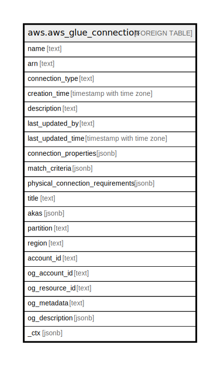

# aws.aws_glue_connection

## Description

AWS Glue Connection

## Columns

| Name | Type | Default | Nullable | Children | Parents | Comment |
| ---- | ---- | ------- | -------- | -------- | ------- | ------- |
| name | text |  | true |  |  | The name of the connection definition. |
| arn | text |  | true |  |  | The Amazon Resource Name (ARN) of the connection. |
| connection_type | text |  | true |  |  | The type of the connection. Currently, SFTP is not supported. |
| creation_time | timestamp with time zone |  | true |  |  | The time that this connection definition was created. |
| description | text |  | true |  |  | The description of the connection. |
| last_updated_by | text |  | true |  |  | The user, group, or role that last updated this connection definition. |
| last_updated_time | timestamp with time zone |  | true |  |  | The last time that this connection definition was updated. |
| connection_properties | jsonb |  | true |  |  | These key-value pairs define parameters for the connection. |
| match_criteria | jsonb |  | true |  |  | A list of criteria that can be used in selecting this connection. |
| physical_connection_requirements | jsonb |  | true |  |  | A map of physical connection requirements, such as virtual private cloud (VPC) and SecurityGroup, that are needed to make this connection successfully. |
| title | text |  | true |  |  | Title of the resource. |
| akas | jsonb |  | true |  |  | Array of globally unique identifier strings (also known as) for the resource. |
| partition | text |  | true |  |  | The AWS partition in which the resource is located (aws, aws-cn, or aws-us-gov). |
| region | text |  | true |  |  | The AWS Region in which the resource is located. |
| account_id | text |  | true |  |  | The AWS Account ID in which the resource is located. |
| og_account_id | text |  | true |  |  | The Platform Account ID in which the resource is located. |
| og_resource_id | text |  | true |  |  | The unique ID of the resource in opengovernance. |
| og_metadata | text |  | true |  |  | Platform Metadata of the AWS resource. |
| og_description | jsonb |  | true |  |  | The full model description of the resource |
| _ctx | jsonb |  | true |  |  | Steampipe context in JSON form, e.g. connection_name. |

## Relations

---

> Generated by [tbls](https://github.com/k1LoW/tbls)
