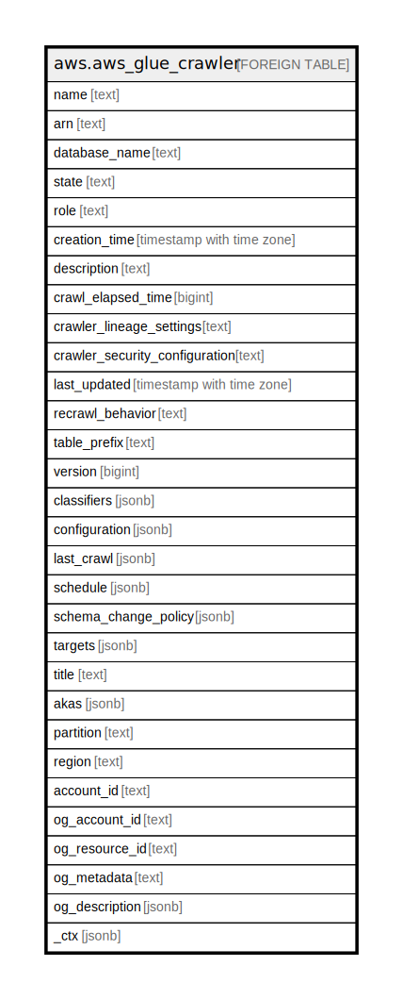

# aws.aws_glue_crawler

## Description

AWS Glue Crawler

## Columns

| Name | Type | Default | Nullable | Children | Parents | Comment |
| ---- | ---- | ------- | -------- | -------- | ------- | ------- |
| name | text |  | true |  |  | The name of the crawler. |
| arn | text |  | true |  |  | The ARN of the crawler. |
| database_name | text |  | true |  |  | The name of the database in which the crawler's output is stored. |
| state | text |  | true |  |  | Indicates whether the crawler is running or pending. |
| role | text |  | true |  |  | The Amazon Resource Name (ARN) of an IAM role that's used to access customer resources, such as Amazon Simple Storage Service (Amazon S3) data. |
| creation_time | timestamp with time zone |  | true |  |  | The time that the crawler was created. |
| description | text |  | true |  |  | A description of the crawler. |
| crawl_elapsed_time | bigint |  | true |  |  | If the crawler is running, contains the total time elapsed since the last crawl began. |
| crawler_lineage_settings | text |  | true |  |  | Specifies whether data lineage is enabled for the crawler. |
| crawler_security_configuration | text |  | true |  |  | The name of the SecurityConfiguration structure to be used by this crawler. |
| last_updated | timestamp with time zone |  | true |  |  | The time that the crawler was last updated. |
| recrawl_behavior | text |  | true |  |  | Specifies whether to crawl the entire dataset again or to crawl only folders that were added since the last crawler run. A value of CRAWL_EVERYTHING specifies crawling the entire dataset again. A value of CRAWL_NEW_FOLDERS_ONLY specifies crawling only folders that were added since the last crawler run. A value of CRAWL_EVENT_MODE specifies crawling only the changes identified by Amazon S3 events. |
| table_prefix | text |  | true |  |  | The prefix added to the names of tables that are created. |
| version | bigint |  | true |  |  | The version of the crawler. |
| classifiers | jsonb |  | true |  |  | A list of UTF-8 strings that specify the custom classifiers that are associated with the crawler. |
| configuration | jsonb |  | true |  |  | Crawler configuration information. |
| last_crawl | jsonb |  | true |  |  | The status of the last crawl, and potentially error information if an error occurred. |
| schedule | jsonb |  | true |  |  | For scheduled crawlers, the schedule when the crawler runs. |
| schema_change_policy | jsonb |  | true |  |  | The policy that specifies update and delete behaviors for the crawler. |
| targets | jsonb |  | true |  |  | A collection of targets to crawl. |
| title | text |  | true |  |  | Title of the resource. |
| akas | jsonb |  | true |  |  | Array of globally unique identifier strings (also known as) for the resource. |
| partition | text |  | true |  |  | The AWS partition in which the resource is located (aws, aws-cn, or aws-us-gov). |
| region | text |  | true |  |  | The AWS Region in which the resource is located. |
| account_id | text |  | true |  |  | The AWS Account ID in which the resource is located. |
| og_account_id | text |  | true |  |  | The Platform Account ID in which the resource is located. |
| og_resource_id | text |  | true |  |  | The unique ID of the resource in opengovernance. |
| og_metadata | text |  | true |  |  | Platform Metadata of the AWS resource. |
| og_description | jsonb |  | true |  |  | The full model description of the resource |
| _ctx | jsonb |  | true |  |  | Steampipe context in JSON form, e.g. connection_name. |

## Relations

---

> Generated by [tbls](https://github.com/k1LoW/tbls)
