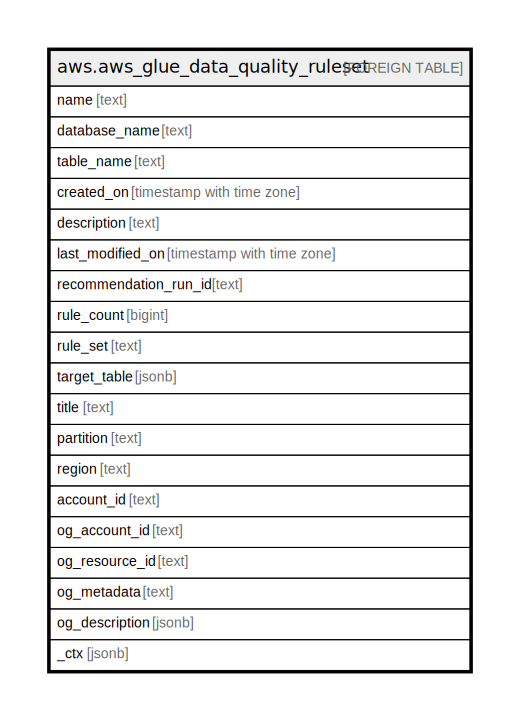

# aws.aws_glue_data_quality_ruleset

## Description

AWS Glue Data Quality Ruleset

## Columns

| Name | Type | Default | Nullable | Children | Parents | Comment |
| ---- | ---- | ------- | -------- | -------- | ------- | ------- |
| name | text |  | true |  |  | The name of the data quality ruleset. |
| database_name | text |  | true |  |  | The name of the database where the glue table exists. |
| table_name | text |  | true |  |  | The name of the glue table. |
| created_on | timestamp with time zone |  | true |  |  | The date and time the data quality ruleset was created. |
| description | text |  | true |  |  | A description of the data quality ruleset. |
| last_modified_on | timestamp with time zone |  | true |  |  | The date and time the data quality ruleset was last modified. |
| recommendation_run_id | text |  | true |  |  | When a ruleset was created from a recommendation run, this run ID is generated to link the two together. |
| rule_count | bigint |  | true |  |  | The number of rules in the ruleset. |
| rule_set | text |  | true |  |  | A Data Quality Definition Language (DQDL) ruleset. |
| target_table | jsonb |  | true |  |  | An object representing a glue table. |
| title | text |  | true |  |  | Title of the resource. |
| partition | text |  | true |  |  | The AWS partition in which the resource is located (aws, aws-cn, or aws-us-gov). |
| region | text |  | true |  |  | The AWS Region in which the resource is located. |
| account_id | text |  | true |  |  | The AWS Account ID in which the resource is located. |
| og_account_id | text |  | true |  |  | The Platform Account ID in which the resource is located. |
| og_resource_id | text |  | true |  |  | The unique ID of the resource in opengovernance. |
| og_metadata | text |  | true |  |  | Platform Metadata of the AWS resource. |
| og_description | jsonb |  | true |  |  | The full model description of the resource |
| _ctx | jsonb |  | true |  |  | Steampipe context in JSON form, e.g. connection_name. |

## Relations

---

> Generated by [tbls](https://github.com/k1LoW/tbls)
