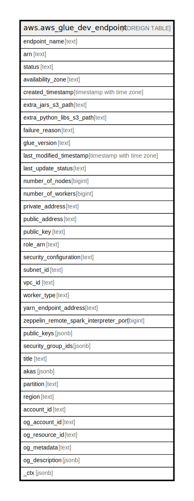

# aws.aws_glue_dev_endpoint

## Description

AWS Glue Dev Endpoint

## Columns

| Name | Type | Default | Nullable | Children | Parents | Comment |
| ---- | ---- | ------- | -------- | -------- | ------- | ------- |
| endpoint_name | text |  | true |  |  | The name of the DevEndpoint. |
| arn | text |  | true |  |  | The Amazon Resource Name (ARN) of the DevEndpoint. |
| status | text |  | true |  |  | The current status of this DevEndpoint. |
| availability_zone | text |  | true |  |  | The AWS Availability Zone where this DevEndpoint is located. |
| created_timestamp | timestamp with time zone |  | true |  |  | The point in time at which this DevEndpoint was created. |
| extra_jars_s3_path | text |  | true |  |  | The path to one or more Java .jar files in an S3 bucket that should be loaded in your DevEndpoint. |
| extra_python_libs_s3_path | text |  | true |  |  | The paths to one or more Python libraries in an Amazon S3 bucket that should be loaded in your DevEndpoint. Multiple values must be complete paths separated by a comma. |
| failure_reason | text |  | true |  |  | The reason for a current failure in this DevEndpoint. |
| glue_version | text |  | true |  |  | Glue version determines the versions of Apache Spark and Python that Glue supports. |
| last_modified_timestamp | timestamp with time zone |  | true |  |  | The point in time at which this DevEndpoint was last modified. |
| last_update_status | text |  | true |  |  | The status of the last update. |
| number_of_nodes | bigint |  | true |  |  | The number of Glue Data Processing Units (DPUs) allocated to this DevEndpoint. |
| number_of_workers | bigint |  | true |  |  | The number of workers of a defined workerType that are allocated to the development endpoint. |
| private_address | text |  | true |  |  | A private IP address to access the DevEndpoint within a VPC if the DevEndpoint is created within one. |
| public_address | text |  | true |  |  | The public IP address used by this DevEndpoint. The PublicAddress field is present only when you create a non-virtual private cloud (VPC) DevEndpoint. |
| public_key | text |  | true |  |  | The public key to be used by this DevEndpoint for authentication. |
| role_arn | text |  | true |  |  | The Amazon Resource Name (ARN) of the IAM role used in this DevEndpoint. |
| security_configuration | text |  | true |  |  | The name of the SecurityConfiguration structure to be used with this DevEndpoint. |
| subnet_id | text |  | true |  |  | The subnet ID for this DevEndpoint. |
| vpc_id | text |  | true |  |  | The ID of the virtual private cloud (VPC) used by this DevEndpoint. |
| worker_type | text |  | true |  |  | The type of predefined worker that is allocated to the development endpoint. Accepts a value of Standard, G.1X, or G.2X. |
| yarn_endpoint_address | text |  | true |  |  | The YARN endpoint address used by this DevEndpoint. |
| zeppelin_remote_spark_interpreter_port | bigint |  | true |  |  | The Apache Zeppelin port for the remote Apache Spark interpreter. |
| public_keys | jsonb |  | true |  |  | A list of public keys to be used by the DevEndpoints for authentication. |
| security_group_ids | jsonb |  | true |  |  | A list of security group identifiers used in this DevEndpoint. |
| title | text |  | true |  |  | Title of the resource. |
| akas | jsonb |  | true |  |  | Array of globally unique identifier strings (also known as) for the resource. |
| partition | text |  | true |  |  | The AWS partition in which the resource is located (aws, aws-cn, or aws-us-gov). |
| region | text |  | true |  |  | The AWS Region in which the resource is located. |
| account_id | text |  | true |  |  | The AWS Account ID in which the resource is located. |
| og_account_id | text |  | true |  |  | The Platform Account ID in which the resource is located. |
| og_resource_id | text |  | true |  |  | The unique ID of the resource in opengovernance. |
| og_metadata | text |  | true |  |  | Platform Metadata of the AWS resource. |
| og_description | jsonb |  | true |  |  | The full model description of the resource |
| _ctx | jsonb |  | true |  |  | Steampipe context in JSON form, e.g. connection_name. |

## Relations

---

> Generated by [tbls](https://github.com/k1LoW/tbls)
