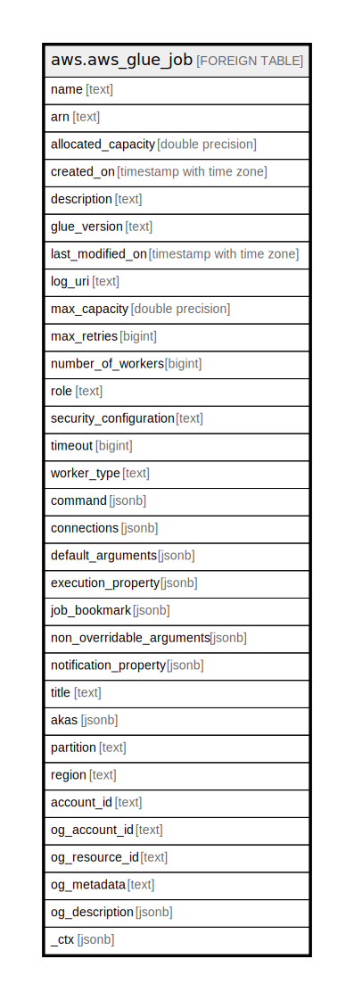

# aws.aws_glue_job

## Description

AWS Glue Job

## Columns

| Name | Type | Default | Nullable | Children | Parents | Comment |
| ---- | ---- | ------- | -------- | -------- | ------- | ------- |
| name | text |  | true |  |  | The name of the GlueJob. |
| arn | text |  | true |  |  | The Amazon Resource Name (ARN) of the GlueJob. |
| allocated_capacity | double precision |  | true |  |  | [DEPRECATED] This column has been deprecated and will be removed in a future release, use max_capacity instead. The number of Glue data processing units (DPUs) that can be allocated when this job runs. |
| created_on | timestamp with time zone |  | true |  |  | The time and date that this job definition was created. |
| description | text |  | true |  |  | A description of the job. |
| glue_version | text |  | true |  |  | Glue version determines the versions of Apache Spark and Python that Glue supports. |
| last_modified_on | timestamp with time zone |  | true |  |  | The last point in time when this job definition was modified. |
| log_uri | text |  | true |  |  | This field is reserved for future use. |
| max_capacity | double precision |  | true |  |  | The number of Glue data processing units (DPUs) that can be allocated when this job runs. |
| max_retries | bigint |  | true |  |  | The maximum number of times to retry this job after a JobRun fails. |
| number_of_workers | bigint |  | true |  |  | The number of workers of a defined workerType that are allocated when a job runs. |
| role | text |  | true |  |  | The name or Amazon Resource Name (ARN) of the IAM role associated with this job. |
| security_configuration | text |  | true |  |  | The name of the SecurityConfiguration structure to be used with this job. |
| timeout | bigint |  | true |  |  | The job timeout in minutes. |
| worker_type | text |  | true |  |  | The type of predefined worker that is allocated when a job runs. Accepts a value of Standard, G.1X, or G.2X. |
| command | jsonb |  | true |  |  | The JobCommand that runs this job. |
| connections | jsonb |  | true |  |  | The connections used for this job. |
| default_arguments | jsonb |  | true |  |  | The default arguments for this job, specified as name-value pairs. |
| execution_property | jsonb |  | true |  |  | An ExecutionProperty specifying the maximum number of concurrent runs allowed for this job. |
| job_bookmark | jsonb |  | true |  |  | Defines a point that a job can resume processing. |
| non_overridable_arguments | jsonb |  | true |  |  | Non-overridable arguments for this job, specified as name-value pairs. |
| notification_property | jsonb |  | true |  |  | Specifies configuration properties of a job notification. |
| title | text |  | true |  |  | Title of the resource. |
| akas | jsonb |  | true |  |  | Array of globally unique identifier strings (also known as) for the resource. |
| partition | text |  | true |  |  | The AWS partition in which the resource is located (aws, aws-cn, or aws-us-gov). |
| region | text |  | true |  |  | The AWS Region in which the resource is located. |
| account_id | text |  | true |  |  | The AWS Account ID in which the resource is located. |
| og_account_id | text |  | true |  |  | The Platform Account ID in which the resource is located. |
| og_resource_id | text |  | true |  |  | The unique ID of the resource in opengovernance. |
| og_metadata | text |  | true |  |  | Platform Metadata of the AWS resource. |
| og_description | jsonb |  | true |  |  | The full model description of the resource |
| _ctx | jsonb |  | true |  |  | Steampipe context in JSON form, e.g. connection_name. |

## Relations

---

> Generated by [tbls](https://github.com/k1LoW/tbls)
