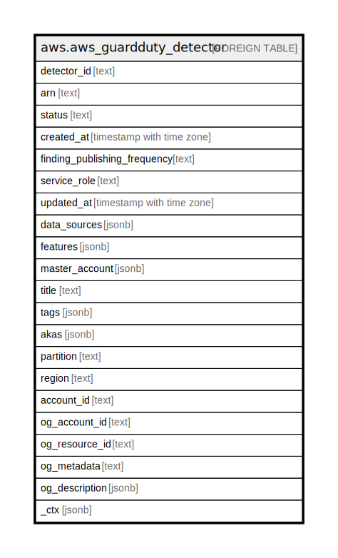

# aws.aws_guardduty_detector

## Description

AWS GuardDuty Detector

## Columns

| Name | Type | Default | Nullable | Children | Parents | Comment |
| ---- | ---- | ------- | -------- | -------- | ------- | ------- |
| detector_id | text |  | true |  |  | The ID of the detector. |
| arn | text |  | true |  |  | The Amazon Resource Name (ARN) specifying the detector. |
| status | text |  | true |  |  | The detector status. |
| created_at | timestamp with time zone |  | true |  |  | The timestamp of when the detector was created. |
| finding_publishing_frequency | text |  | true |  |  | The publishing frequency of the finding. |
| service_role | text |  | true |  |  | The GuardDuty service role. |
| updated_at | timestamp with time zone |  | true |  |  | The last-updated timestamp for the detector. |
| data_sources | jsonb |  | true |  |  | Describes which data sources are enabled for the detector. |
| features | jsonb |  | true |  |  | Describes the features that have been enabled for the detector. |
| master_account | jsonb |  | true |  |  | Contains information about the administrator account and invitation. |
| title | text |  | true |  |  | Title of the resource. |
| tags | jsonb |  | true |  |  | A map of tags for the resource. |
| akas | jsonb |  | true |  |  | Array of globally unique identifier strings (also known as) for the resource. |
| partition | text |  | true |  |  | The AWS partition in which the resource is located (aws, aws-cn, or aws-us-gov). |
| region | text |  | true |  |  | The AWS Region in which the resource is located. |
| account_id | text |  | true |  |  | The AWS Account ID in which the resource is located. |
| og_account_id | text |  | true |  |  | The Platform Account ID in which the resource is located. |
| og_resource_id | text |  | true |  |  | The unique ID of the resource in opengovernance. |
| og_metadata | text |  | true |  |  | Platform Metadata of the AWS resource. |
| og_description | jsonb |  | true |  |  | The full model description of the resource |
| _ctx | jsonb |  | true |  |  | Steampipe context in JSON form, e.g. connection_name. |

## Relations

---

> Generated by [tbls](https://github.com/k1LoW/tbls)
