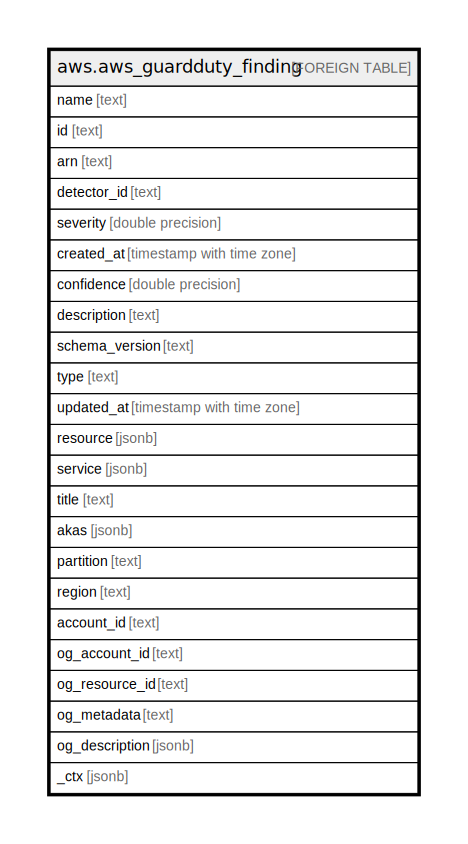

# aws.aws_guardduty_finding

## Description

AWS GuardDuty Finding

## Columns

| Name | Type | Default | Nullable | Children | Parents | Comment |
| ---- | ---- | ------- | -------- | -------- | ------- | ------- |
| name | text |  | true |  |  | The title of the finding. |
| id | text |  | true |  |  | The ID of the finding. |
| arn | text |  | true |  |  | The Amazon Resource Name (ARN) specifying the finding. |
| detector_id | text |  | true |  |  | The ID of the detector. |
| severity | double precision |  | true |  |  | The severity of the finding. |
| created_at | timestamp with time zone |  | true |  |  | The time and date when the finding was created. |
| confidence | double precision |  | true |  |  | The confidence score for the finding. |
| description | text |  | true |  |  | The description of the finding. |
| schema_version | text |  | true |  |  | The version of the schema used for the finding. |
| type | text |  | true |  |  | The type of finding. |
| updated_at | timestamp with time zone |  | true |  |  | The time and date when the finding was last updated. |
| resource | jsonb |  | true |  |  | Contains information about the AWS resource associated with the activity that prompted GuardDuty to generate a finding. |
| service | jsonb |  | true |  |  | Contains additional information about the generated finding. |
| title | text |  | true |  |  | Title of the resource. |
| akas | jsonb |  | true |  |  | Array of globally unique identifier strings (also known as) for the resource. |
| partition | text |  | true |  |  | The AWS partition in which the resource is located (aws, aws-cn, or aws-us-gov). |
| region | text |  | true |  |  | The AWS Region in which the resource is located. |
| account_id | text |  | true |  |  | The AWS Account ID in which the resource is located. |
| og_account_id | text |  | true |  |  | The Platform Account ID in which the resource is located. |
| og_resource_id | text |  | true |  |  | The unique ID of the resource in opengovernance. |
| og_metadata | text |  | true |  |  | Platform Metadata of the AWS resource. |
| og_description | jsonb |  | true |  |  | The full model description of the resource |
| _ctx | jsonb |  | true |  |  | Steampipe context in JSON form, e.g. connection_name. |

## Relations

---

> Generated by [tbls](https://github.com/k1LoW/tbls)
