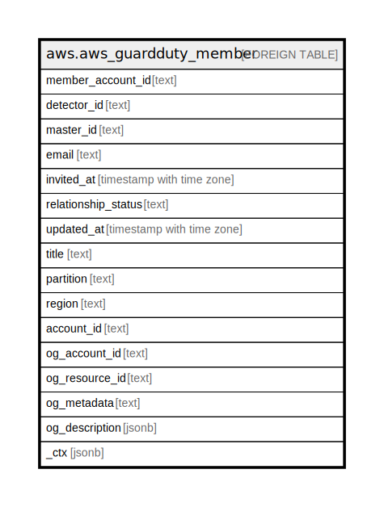

# aws.aws_guardduty_member

## Description

AWS GuardDuty Member

## Columns

| Name | Type | Default | Nullable | Children | Parents | Comment |
| ---- | ---- | ------- | -------- | -------- | ------- | ------- |
| member_account_id | text |  | true |  |  | The ID of the member account. |
| detector_id | text |  | true |  |  | The detector ID of the member account. |
| master_id | text |  | true |  |  | The administrator account ID. |
| email | text |  | true |  |  | The email address of the member account. |
| invited_at | timestamp with time zone |  | true |  |  | The timestamp when the invitation was sent. |
| relationship_status | text |  | true |  |  | The status of the relationship between the member and the administrator. |
| updated_at | timestamp with time zone |  | true |  |  | The last-updated timestamp of the member. |
| title | text |  | true |  |  | Title of the resource. |
| partition | text |  | true |  |  | The AWS partition in which the resource is located (aws, aws-cn, or aws-us-gov). |
| region | text |  | true |  |  | The AWS Region in which the resource is located. |
| account_id | text |  | true |  |  | The AWS Account ID in which the resource is located. |
| og_account_id | text |  | true |  |  | The Platform Account ID in which the resource is located. |
| og_resource_id | text |  | true |  |  | The unique ID of the resource in opengovernance. |
| og_metadata | text |  | true |  |  | Platform Metadata of the AWS resource. |
| og_description | jsonb |  | true |  |  | The full model description of the resource |
| _ctx | jsonb |  | true |  |  | Steampipe context in JSON form, e.g. connection_name. |

## Relations

---

> Generated by [tbls](https://github.com/k1LoW/tbls)
