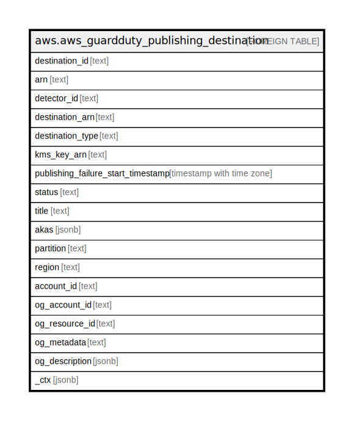

# aws.aws_guardduty_publishing_destination

## Description

AWS GuardDuty Publishing Destination

## Columns

| Name | Type | Default | Nullable | Children | Parents | Comment |
| ---- | ---- | ------- | -------- | -------- | ------- | ------- |
| destination_id | text |  | true |  |  | The ID of the publishing destination. |
| arn | text |  | true |  |  | The Amazon Resource Name (ARN) for the publishing destination. |
| detector_id | text |  | true |  |  | The ID of the detector. |
| destination_arn | text |  | true |  |  | The ARN of the resource to publish to. |
| destination_type | text |  | true |  |  | The type of publishing destination. Currently, only Amazon S3 buckets are supported. |
| kms_key_arn | text |  | true |  |  | The ARN of the KMS key to use for encryption. |
| publishing_failure_start_timestamp | timestamp with time zone |  | true |  |  | The time, in epoch millisecond format, at which GuardDuty was first unable to publish findings to the destination. |
| status | text |  | true |  |  | The status of the publishing destination. |
| title | text |  | true |  |  | Title of the resource. |
| akas | jsonb |  | true |  |  | Array of globally unique identifier strings (also known as) for the resource. |
| partition | text |  | true |  |  | The AWS partition in which the resource is located (aws, aws-cn, or aws-us-gov). |
| region | text |  | true |  |  | The AWS Region in which the resource is located. |
| account_id | text |  | true |  |  | The AWS Account ID in which the resource is located. |
| og_account_id | text |  | true |  |  | The Platform Account ID in which the resource is located. |
| og_resource_id | text |  | true |  |  | The unique ID of the resource in opengovernance. |
| og_metadata | text |  | true |  |  | Platform Metadata of the AWS resource. |
| og_description | jsonb |  | true |  |  | The full model description of the resource |
| _ctx | jsonb |  | true |  |  | Steampipe context in JSON form, e.g. connection_name. |

## Relations

---

> Generated by [tbls](https://github.com/k1LoW/tbls)
