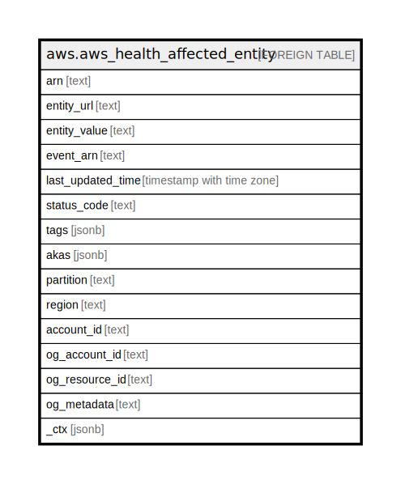

# aws.aws_health_affected_entity

## Description

AWS Health Affected Entity

## Columns

| Name | Type | Default | Nullable | Children | Parents | Comment |
| ---- | ---- | ------- | -------- | -------- | ------- | ------- |
| arn | text |  | true |  |  | The Amazon Resource Name (ARN) of the health entity. |
| entity_url | text |  | true |  |  | The URL of the affected entity. |
| entity_value | text |  | true |  |  | The ID of the affected entity. |
| event_arn | text |  | true |  |  | The Amazon Resource Name (ARN) of the health event. |
| last_updated_time | timestamp with time zone |  | true |  |  | The most recent time that the entity was updated. |
| status_code | text |  | true |  |  | The most recent status of the entity affected by the event. The possible values are IMPAIRED, UNIMPAIRED, and UNKNOWN. |
| tags | jsonb |  | true |  |  | A map of tags for the resource. |
| akas | jsonb |  | true |  |  | Array of globally unique identifier strings (also known as) for the resource. |
| partition | text |  | true |  |  | The AWS partition in which the resource is located (aws, aws-cn, or aws-us-gov). |
| region | text |  | true |  |  | The AWS Region in which the resource is located. |
| account_id | text |  | true |  |  | The AWS Account ID in which the resource is located. |
| og_account_id | text |  | true |  |  | The Platform Account ID in which the resource is located. |
| og_resource_id | text |  | true |  |  | The unique ID of the resource in opengovernance. |
| og_metadata | text |  | true |  |  | Platform Metadata of the AWS resource. |
| _ctx | jsonb |  | true |  |  | Steampipe context in JSON form, e.g. connection_name. |

## Relations

---

> Generated by [tbls](https://github.com/k1LoW/tbls)
