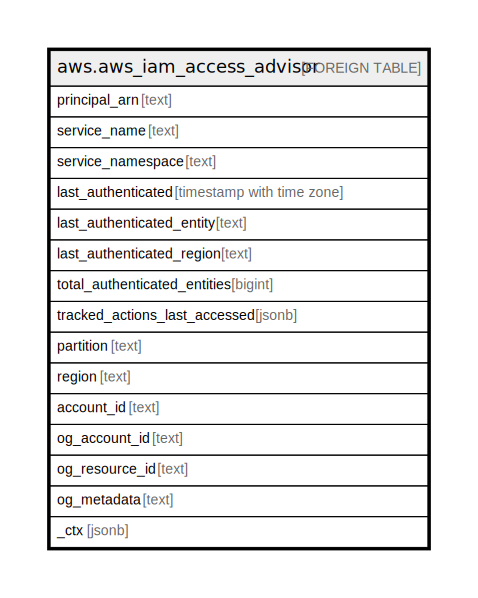

# aws.aws_iam_access_advisor

## Description

AWS IAM Access Advisor

## Columns

| Name | Type | Default | Nullable | Children | Parents | Comment |
| ---- | ---- | ------- | -------- | -------- | ------- | ------- |
| principal_arn | text |  | true |  |  | The ARN of the IAM resource (user, group, role, or managed policy) used to generate information about when the resource was last used in an attempt to access an AWS service. |
| service_name | text |  | true |  |  | The name of the service in which access was attempted. |
| service_namespace | text |  | true |  |  | The namespace of the service in which access was attempted. |
| last_authenticated | timestamp with time zone |  | true |  |  | The date and time when an authenticated entity most recently attempted to access the service. AWS does not report unauthenticated requests. |
| last_authenticated_entity | text |  | true |  |  | The ARN of the authenticated entity (user or role) that last attempted to access the service. AWS does not report unauthenticated requests. |
| last_authenticated_region | text |  | true |  |  | The Region from which the authenticated entity (user or role) last attempted to access the service. AWS does not report unauthenticated requests. |
| total_authenticated_entities | bigint |  | true |  |  | The total number of authenticated principals (root user, IAM users, or IAM roles) that have attempted to access the service. |
| tracked_actions_last_accessed | jsonb |  | true |  |  | An array of objects that contains details about the most recent attempt to access a tracked action within the service.  Currently, only S3 supports action level tracking. |
| partition | text |  | true |  |  | The AWS partition in which the resource is located (aws, aws-cn, or aws-us-gov). |
| region | text |  | true |  |  | The AWS Region in which the resource is located. |
| account_id | text |  | true |  |  | The AWS Account ID in which the resource is located. |
| og_account_id | text |  | true |  |  | The Platform Account ID in which the resource is located. |
| og_resource_id | text |  | true |  |  | The unique ID of the resource in opengovernance. |
| og_metadata | text |  | true |  |  | Platform Metadata of the AWS resource. |
| _ctx | jsonb |  | true |  |  | Steampipe context in JSON form, e.g. connection_name. |

## Relations

---

> Generated by [tbls](https://github.com/k1LoW/tbls)
