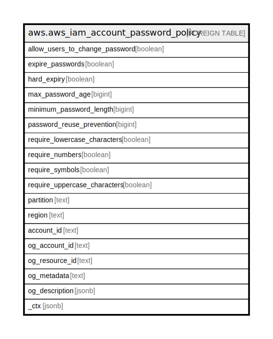

# aws.aws_iam_account_password_policy

## Description

AWS IAM Account Password Policy

## Columns

| Name | Type | Default | Nullable | Children | Parents | Comment |
| ---- | ---- | ------- | -------- | -------- | ------- | ------- |
| allow_users_to_change_password | boolean |  | true |  |  | Specifies whether IAM users are allowed to change their own password. |
| expire_passwords | boolean |  | true |  |  | Indicates whether passwords in the account expire. Returns true if MaxPasswordAge contains a value greater than 0. Returns false if MaxPasswordAge is 0 or not present. |
| hard_expiry | boolean |  | true |  |  | Specifies whether IAM users are prevented from setting a new password after. |
| max_password_age | bigint |  | true |  |  | The number of days that an IAM user password is valid. |
| minimum_password_length | bigint |  | true |  |  | Minimum length to require for IAM user passwords. |
| password_reuse_prevention | bigint |  | true |  |  | Specifies the number of previous passwords that IAM users are prevented from reusing. |
| require_lowercase_characters | boolean |  | true |  |  | Specifies whether to require lowercase characters for IAM user passwords. |
| require_numbers | boolean |  | true |  |  | Specifies whether to require numbers for IAM user passwords. |
| require_symbols | boolean |  | true |  |  | Specifies whether to require symbols for IAM user passwords. |
| require_uppercase_characters | boolean |  | true |  |  | Specifies whether to require uppercase characters for IAM user passwords. |
| partition | text |  | true |  |  | The AWS partition in which the resource is located (aws, aws-cn, or aws-us-gov). |
| region | text |  | true |  |  | The AWS Region in which the resource is located. |
| account_id | text |  | true |  |  | The AWS Account ID in which the resource is located. |
| og_account_id | text |  | true |  |  | The Platform Account ID in which the resource is located. |
| og_resource_id | text |  | true |  |  | The unique ID of the resource in opengovernance. |
| og_metadata | text |  | true |  |  | Platform Metadata of the AWS resource. |
| og_description | jsonb |  | true |  |  | The full model description of the resource |
| _ctx | jsonb |  | true |  |  | Steampipe context in JSON form, e.g. connection_name. |

## Relations

---

> Generated by [tbls](https://github.com/k1LoW/tbls)
