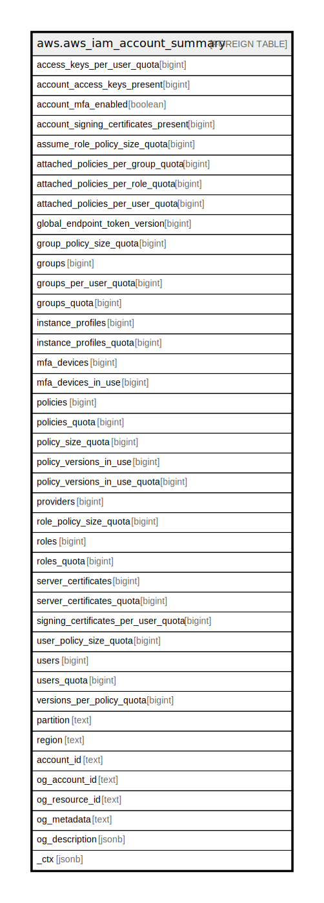

# aws.aws_iam_account_summary

## Description

AWS IAM Account Summary

## Columns

| Name | Type | Default | Nullable | Children | Parents | Comment |
| ---- | ---- | ------- | -------- | -------- | ------- | ------- |
| access_keys_per_user_quota | bigint |  | true |  |  | Specifies the allowed quota of access keys per user. |
| account_access_keys_present | bigint |  | true |  |  | Specifies the number of account level access keys present. |
| account_mfa_enabled | boolean |  | true |  |  | Specifies whether MFA is enabled for the account. |
| account_signing_certificates_present | bigint |  | true |  |  | Specifies the number of account signing certificates present. |
| assume_role_policy_size_quota | bigint |  | true |  |  | Specifies the allowed assume role policy size. |
| attached_policies_per_group_quota | bigint |  | true |  |  | Specifies the allowed attached policies per group. |
| attached_policies_per_role_quota | bigint |  | true |  |  | Specifies the allowed attached policies per role. |
| attached_policies_per_user_quota | bigint |  | true |  |  | Specifies the allowed attached policies per user. |
| global_endpoint_token_version | bigint |  | true |  |  | Specifies the token version of the global endpoint. |
| group_policy_size_quota | bigint |  | true |  |  | Specifies the allowed group policy size. |
| groups | bigint |  | true |  |  | Specifies the number of groups. |
| groups_per_user_quota | bigint |  | true |  |  | Specifies the allowed number of groups. |
| groups_quota | bigint |  | true |  |  | Specifies the allowed number of groups. |
| instance_profiles | bigint |  | true |  |  | Specifies the number of groups. |
| instance_profiles_quota | bigint |  | true |  |  | Specifies the allowed number of groups. |
| mfa_devices | bigint |  | true |  |  | Specifies the number of MFA devices. |
| mfa_devices_in_use | bigint |  | true |  |  | Specifies the number of MFA devices in use. |
| policies | bigint |  | true |  |  | Specifies the number of policies. |
| policies_quota | bigint |  | true |  |  | Specifies the allowed number of policies. |
| policy_size_quota | bigint |  | true |  |  | Specifies the allowed size of policies. |
| policy_versions_in_use | bigint |  | true |  |  | Specifies the number of policy versions in use. |
| policy_versions_in_use_quota | bigint |  | true |  |  | Specifies the allowed number of policy versions. |
| providers | bigint |  | true |  |  | Specifies the number of providers. |
| role_policy_size_quota | bigint |  | true |  |  | Specifies the allowed role policy size. |
| roles | bigint |  | true |  |  | Specifies the number of roles. |
| roles_quota | bigint |  | true |  |  | Specifies the allowed number of roles. |
| server_certificates | bigint |  | true |  |  | Specifies the number of server certificates. |
| server_certificates_quota | bigint |  | true |  |  | Specifies the allowed number of server certificates. |
| signing_certificates_per_user_quota | bigint |  | true |  |  | Specifies the allowed number of signing certificates per user. |
| user_policy_size_quota | bigint |  | true |  |  | Specifies the allowed user policy size. |
| users | bigint |  | true |  |  | Specifies the number of users. |
| users_quota | bigint |  | true |  |  | Specifies the allowed number of users. |
| versions_per_policy_quota | bigint |  | true |  |  | Specifies the allowed number of versions per policy. |
| partition | text |  | true |  |  | The AWS partition in which the resource is located (aws, aws-cn, or aws-us-gov). |
| region | text |  | true |  |  | The AWS Region in which the resource is located. |
| account_id | text |  | true |  |  | The AWS Account ID in which the resource is located. |
| og_account_id | text |  | true |  |  | The Platform Account ID in which the resource is located. |
| og_resource_id | text |  | true |  |  | The unique ID of the resource in opengovernance. |
| og_metadata | text |  | true |  |  | Platform Metadata of the AWS resource. |
| og_description | jsonb |  | true |  |  | The full model description of the resource |
| _ctx | jsonb |  | true |  |  | Steampipe context in JSON form, e.g. connection_name. |

## Relations

---

> Generated by [tbls](https://github.com/k1LoW/tbls)
