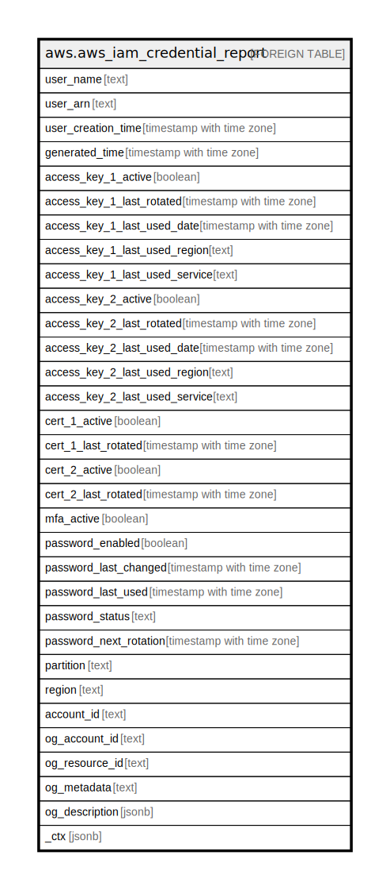

# aws.aws_iam_credential_report

## Description

AWS IAM Credential Report

## Columns

| Name | Type | Default | Nullable | Children | Parents | Comment |
| ---- | ---- | ------- | -------- | -------- | ------- | ------- |
| user_name | text |  | true |  |  | The friendly name of the user. |
| user_arn | text |  | true |  |  | The Amazon Resource Name (ARN) of the user. |
| user_creation_time | timestamp with time zone |  | true |  |  | The date and time when the user was created. |
| generated_time | timestamp with time zone |  | true |  |  | The date and time when the credential report was created, in ISO 8601 date-time format (http://www.iso.org/iso/iso8601). |
| access_key_1_active | boolean |  | true |  |  | Does the user have an access key and is the access key's status Active. |
| access_key_1_last_rotated | timestamp with time zone |  | true |  |  | The date and time when the user's access key was created or last changed. |
| access_key_1_last_used_date | timestamp with time zone |  | true |  |  | The date and time when the user's access key was most recently used to sign an AWS API request. When an access key is used more than once in a 15-minute span, only the first use is recorded in this field. |
| access_key_1_last_used_region | text |  | true |  |  | The AWS Region in which the access key was most recently used. When an access key is used more than once in a 15-minute span, only the first use is recorded in this field. |
| access_key_1_last_used_service | text |  | true |  |  | The AWS service that was most recently accessed with the access key. The value in this field uses the service's namespace—for example, s3 for Amazon S3 and ec2 for Amazon EC2. When an access key is used more than once in a 15-minute span, only the first use is recorded in this field. |
| access_key_2_active | boolean |  | true |  |  | Does the user have a second access key and is the access key's status Active. |
| access_key_2_last_rotated | timestamp with time zone |  | true |  |  | The date and time when the user's second access key was created or last changed. |
| access_key_2_last_used_date | timestamp with time zone |  | true |  |  | The date and time when the user's second access key was most recently used to sign an AWS API request. When an access key is used more than once in a 15-minute span, only the first use is recorded in this field. |
| access_key_2_last_used_region | text |  | true |  |  | The AWS Region in which the user's second access key was most recently used. When an access key is used more than once in a 15-minute span, only the first use is recorded in this field. |
| access_key_2_last_used_service | text |  | true |  |  | The AWS service that was most recently accessed with the user's second access key. The value in this field uses the service's namespace—for example, s3 for Amazon S3 and ec2 for Amazon EC2. When an access key is used more than once in a 15-minute span, only the first use is recorded in this field. |
| cert_1_active | boolean |  | true |  |  | Does the user have an X.509 signing certificate and is that certificate's status Active. |
| cert_1_last_rotated | timestamp with time zone |  | true |  |  | The date and time when the user's signing certificate was created or last changed. |
| cert_2_active | boolean |  | true |  |  | Does the user have a second X.509 signing certificate and is that certificate's status Active. |
| cert_2_last_rotated | timestamp with time zone |  | true |  |  | The date and time when the user's second signing certificate was created or last changed. |
| mfa_active | boolean |  | true |  |  | Whether a multi-factor authentication (MFA) device has been enabled for the user. |
| password_enabled | boolean |  | true |  |  | When the user has a password, this value is true. Otherwise it is false. The value for the AWS account root user is always false. |
| password_last_changed | timestamp with time zone |  | true |  |  | The date and time when the user's password was last set. |
| password_last_used | timestamp with time zone |  | true |  |  | The date and time when the AWS account root user or IAM user's password was last used to sign in to an AWS website. |
| password_status | text |  | true |  |  | The status of an user password. Password status can be one of used, never_used and not_set. |
| password_next_rotation | timestamp with time zone |  | true |  |  | When the account has a password policy that requires password rotation, this field contains the date and time. |
| partition | text |  | true |  |  | The AWS partition in which the resource is located (aws, aws-cn, or aws-us-gov). |
| region | text |  | true |  |  | The AWS Region in which the resource is located. |
| account_id | text |  | true |  |  | The AWS Account ID in which the resource is located. |
| og_account_id | text |  | true |  |  | The Platform Account ID in which the resource is located. |
| og_resource_id | text |  | true |  |  | The unique ID of the resource in opengovernance. |
| og_metadata | text |  | true |  |  | Platform Metadata of the AWS resource. |
| og_description | jsonb |  | true |  |  | The full model description of the resource |
| _ctx | jsonb |  | true |  |  | Steampipe context in JSON form, e.g. connection_name. |

## Relations

---

> Generated by [tbls](https://github.com/k1LoW/tbls)
