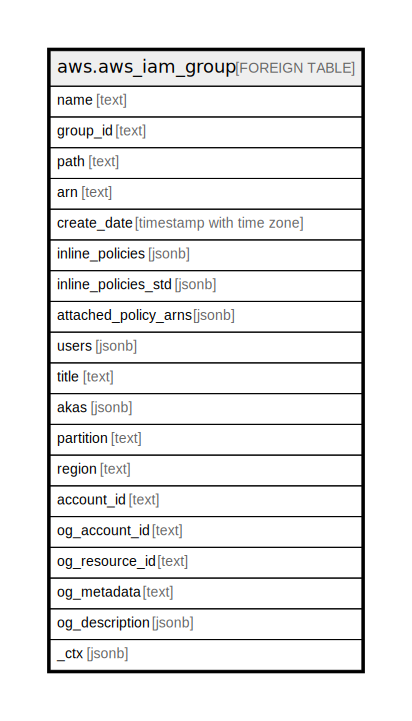

# aws.aws_iam_group

## Description

AWS IAM Group

## Columns

| Name | Type | Default | Nullable | Children | Parents | Comment |
| ---- | ---- | ------- | -------- | -------- | ------- | ------- |
| name | text |  | true |  |  | The friendly name that identifies the group. |
| group_id | text |  | true |  |  | The stable and unique string identifying the group. |
| path | text |  | true |  |  | The path to the group. |
| arn | text |  | true |  |  | The Amazon Resource Name (ARN) specifying the group. |
| create_date | timestamp with time zone |  | true |  |  | The date and time, when the group was created. |
| inline_policies | jsonb |  | true |  |  | A list of policy documents that are embedded as inline policies for the group. |
| inline_policies_std | jsonb |  | true |  |  | Inline policies in canonical form for the group. |
| attached_policy_arns | jsonb |  | true |  |  | A list of managed policies attached to the group. |
| users | jsonb |  | true |  |  | A list of users in the group. |
| title | text |  | true |  |  | Title of the resource. |
| akas | jsonb |  | true |  |  | Array of globally unique identifier strings (also known as) for the resource. |
| partition | text |  | true |  |  | The AWS partition in which the resource is located (aws, aws-cn, or aws-us-gov). |
| region | text |  | true |  |  | The AWS Region in which the resource is located. |
| account_id | text |  | true |  |  | The AWS Account ID in which the resource is located. |
| og_account_id | text |  | true |  |  | The Platform Account ID in which the resource is located. |
| og_resource_id | text |  | true |  |  | The unique ID of the resource in opengovernance. |
| og_metadata | text |  | true |  |  | Platform Metadata of the AWS resource. |
| og_description | jsonb |  | true |  |  | The full model description of the resource |
| _ctx | jsonb |  | true |  |  | Steampipe context in JSON form, e.g. connection_name. |

## Relations

---

> Generated by [tbls](https://github.com/k1LoW/tbls)
