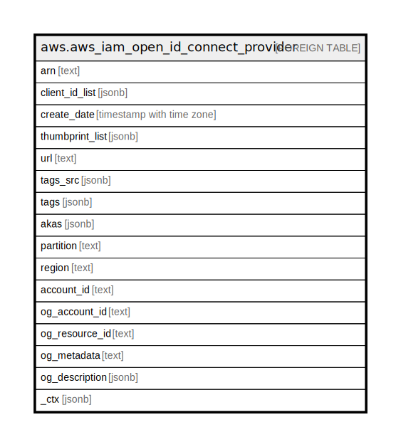

# aws.aws_iam_open_id_connect_provider

## Description

AWS IAM OpenID Connect Provider

## Columns

| Name | Type | Default | Nullable | Children | Parents | Comment |
| ---- | ---- | ------- | -------- | -------- | ------- | ------- |
| arn | text |  | true |  |  | The Amazon Resource Name (ARN) specifying the OIDC provider resource. |
| client_id_list | jsonb |  | true |  |  | A list of client IDs (also known as audiences) that are associated with the specified IAM OIDC provider resource object. |
| create_date | timestamp with time zone |  | true |  |  | The date and time when the IAM OIDC provider resource object was created in the Amazon Web Services account. |
| thumbprint_list | jsonb |  | true |  |  | A list of certificate thumbprints that are associated with the specified IAM OIDC provider resource object. |
| url | text |  | true |  |  | The URL that the IAM OIDC provider resource object is associated with. |
| tags_src | jsonb |  | true |  |  | A list of tags that are attached to the specified IAM OIDC provider. |
| tags | jsonb |  | true |  |  | A map of tags for the resource. |
| akas | jsonb |  | true |  |  | Array of globally unique identifier strings (also known as) for the resource. |
| partition | text |  | true |  |  | The AWS partition in which the resource is located (aws, aws-cn, or aws-us-gov). |
| region | text |  | true |  |  | The AWS Region in which the resource is located. |
| account_id | text |  | true |  |  | The AWS Account ID in which the resource is located. |
| og_account_id | text |  | true |  |  | The Platform Account ID in which the resource is located. |
| og_resource_id | text |  | true |  |  | The unique ID of the resource in opengovernance. |
| og_metadata | text |  | true |  |  | Platform Metadata of the AWS resource. |
| og_description | jsonb |  | true |  |  | The full model description of the resource |
| _ctx | jsonb |  | true |  |  | Steampipe context in JSON form, e.g. connection_name. |

## Relations

---

> Generated by [tbls](https://github.com/k1LoW/tbls)
