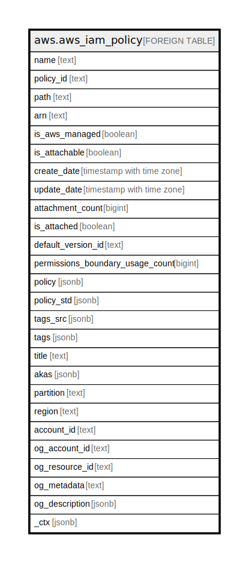

# aws.aws_iam_policy

## Description

AWS IAM Policy

## Columns

| Name | Type | Default | Nullable | Children | Parents | Comment |
| ---- | ---- | ------- | -------- | -------- | ------- | ------- |
| name | text |  | true |  |  | The friendly name that identifies the iam policy. |
| policy_id | text |  | true |  |  | The stable and unique string identifying the policy. |
| path | text |  | true |  |  | The path to the policy. |
| arn | text |  | true |  |  | The Amazon Resource Name (ARN) specifying the iam policy. |
| is_aws_managed | boolean |  | true |  |  | Specifies whether the policy is AWS Managed or Customer Managed. If true policy is aws managed otherwise customer managed. |
| is_attachable | boolean |  | true |  |  | Specifies whether the policy can be attached to an IAM user, group, or role. |
| create_date | timestamp with time zone |  | true |  |  | The date and time, when the policy was created. |
| update_date | timestamp with time zone |  | true |  |  | The date and time, when the policy was last updated. |
| attachment_count | bigint |  | true |  |  | The number of entities (users, groups, and roles) that the policy is attached to. |
| is_attached | boolean |  | true |  |  | Specifies whether the policy is attached to at least one IAM user, group, or role. |
| default_version_id | text |  | true |  |  | The identifier for the version of the policy that is set as the default version. |
| permissions_boundary_usage_count | bigint |  | true |  |  | The number of entities (users and roles) for which the policy is used to set the permissions boundary. |
| policy | jsonb |  | true |  |  | Contains the details about the policy. |
| policy_std | jsonb |  | true |  |  | Contains the policy in a canonical form for easier searching. |
| tags_src | jsonb |  | true |  |  | A list of tags attached with the IAM policy. |
| tags | jsonb |  | true |  |  | A map of tags for the resource. |
| title | text |  | true |  |  | Title of the resource. |
| akas | jsonb |  | true |  |  | Array of globally unique identifier strings (also known as) for the resource. |
| partition | text |  | true |  |  | The AWS partition in which the resource is located (aws, aws-cn, or aws-us-gov). |
| region | text |  | true |  |  | The AWS Region in which the resource is located. |
| account_id | text |  | true |  |  | The AWS Account ID in which the resource is located. |
| og_account_id | text |  | true |  |  | The Platform Account ID in which the resource is located. |
| og_resource_id | text |  | true |  |  | The unique ID of the resource in opengovernance. |
| og_metadata | text |  | true |  |  | Platform Metadata of the AWS resource. |
| og_description | jsonb |  | true |  |  | The full model description of the resource |
| _ctx | jsonb |  | true |  |  | Steampipe context in JSON form, e.g. connection_name. |

## Relations

---

> Generated by [tbls](https://github.com/k1LoW/tbls)
