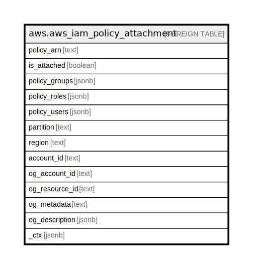

# aws.aws_iam_policy_attachment

## Description

AWS IAM Policy Attachment

## Columns

| Name | Type | Default | Nullable | Children | Parents | Comment |
| ---- | ---- | ------- | -------- | -------- | ------- | ------- |
| policy_arn | text |  | true |  |  | The Amazon Resource Name (ARN) specifying the IAM policy. |
| is_attached | boolean |  | true |  |  | Specifies whether the policy is attached to at least one IAM user, group, or role. |
| policy_groups | jsonb |  | true |  |  | A list of IAM groups that the policy is attached to. |
| policy_roles | jsonb |  | true |  |  | A list of IAM roles that the policy is attached to. |
| policy_users | jsonb |  | true |  |  | A list of IAM users that the policy is attached to. |
| partition | text |  | true |  |  | The AWS partition in which the resource is located (aws, aws-cn, or aws-us-gov). |
| region | text |  | true |  |  | The AWS Region in which the resource is located. |
| account_id | text |  | true |  |  | The AWS Account ID in which the resource is located. |
| og_account_id | text |  | true |  |  | The Platform Account ID in which the resource is located. |
| og_resource_id | text |  | true |  |  | The unique ID of the resource in opengovernance. |
| og_metadata | text |  | true |  |  | Platform Metadata of the AWS resource. |
| og_description | jsonb |  | true |  |  | The full model description of the resource |
| _ctx | jsonb |  | true |  |  | Steampipe context in JSON form, e.g. connection_name. |

## Relations

---

> Generated by [tbls](https://github.com/k1LoW/tbls)
