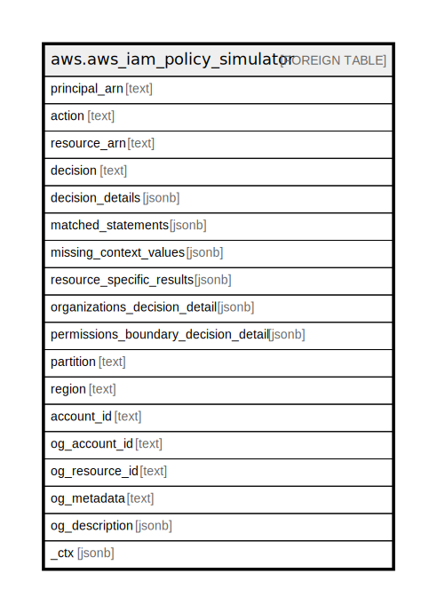

# aws.aws_iam_policy_simulator

## Description

AWS IAM Policy Simulator

## Columns

| Name | Type | Default | Nullable | Children | Parents | Comment |
| ---- | ---- | ------- | -------- | -------- | ------- | ------- |
| principal_arn | text |  | true |  |  | The principal Amazon Resource Name (ARN) for this policy simulation. |
| action | text |  | true |  |  | The action for this policy simulation. |
| resource_arn | text |  | true |  |  | The resource for this policy simulation. |
| decision | text |  | true |  |  | The decision for this policy simulation. |
| decision_details | jsonb |  | true |  |  | The decision details for this policy simulation. |
| matched_statements | jsonb |  | true |  |  | The matched statements for this policy simulation. |
| missing_context_values | jsonb |  | true |  |  | The missing content values for this policy simulation. |
| resource_specific_results | jsonb |  | true |  |  | The resource specific results for this policy simulation. |
| organizations_decision_detail | jsonb |  | true |  |  | The organizations decision detail for this policy simulation. |
| permissions_boundary_decision_detail | jsonb |  | true |  |  | The permissions boundary decision detail for this policy simulation. |
| partition | text |  | true |  |  | The AWS partition in which the resource is located (aws, aws-cn, or aws-us-gov). |
| region | text |  | true |  |  | The AWS Region in which the resource is located. |
| account_id | text |  | true |  |  | The AWS Account ID in which the resource is located. |
| og_account_id | text |  | true |  |  | The Platform Account ID in which the resource is located. |
| og_resource_id | text |  | true |  |  | The unique ID of the resource in opengovernance. |
| og_metadata | text |  | true |  |  | Platform Metadata of the AWS resource. |
| og_description | jsonb |  | true |  |  | The full model description of the resource |
| _ctx | jsonb |  | true |  |  | Steampipe context in JSON form, e.g. connection_name. |

## Relations

---

> Generated by [tbls](https://github.com/k1LoW/tbls)
