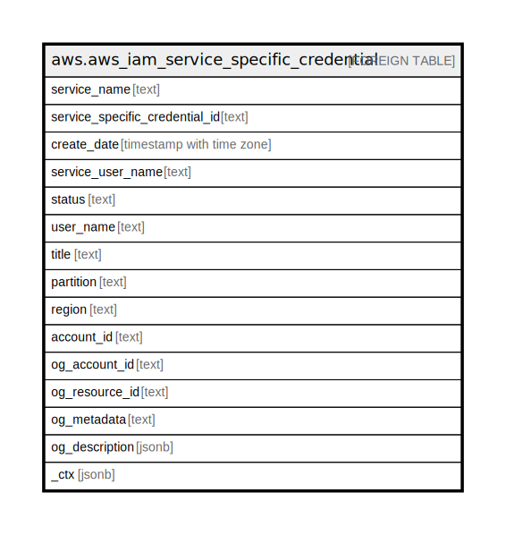

# aws.aws_iam_service_specific_credential

## Description

AWS IAM User Service Specific Credential

## Columns

| Name | Type | Default | Nullable | Children | Parents | Comment |
| ---- | ---- | ------- | -------- | -------- | ------- | ------- |
| service_name | text |  | true |  |  | The name of the service associated with the service-specific credential. |
| service_specific_credential_id | text |  | true |  |  | The unique identifier for the service-specific credential. |
| create_date | timestamp with time zone |  | true |  |  | The date and time, in ISO 8601 date-time format (http://www.iso.org/iso/iso8601), when the service-specific credential were created. |
| service_user_name | text |  | true |  |  | The generated user name for the service-specific credential. |
| status | text |  | true |  |  | The status of the service-specific credential. Active means that the key is valid for API calls, while Inactive means it is not. |
| user_name | text |  | true |  |  | The name of the IAM user associated with the service-specific credential. |
| title | text |  | true |  |  | Title of the resource. |
| partition | text |  | true |  |  | The AWS partition in which the resource is located (aws, aws-cn, or aws-us-gov). |
| region | text |  | true |  |  | The AWS Region in which the resource is located. |
| account_id | text |  | true |  |  | The AWS Account ID in which the resource is located. |
| og_account_id | text |  | true |  |  | The Platform Account ID in which the resource is located. |
| og_resource_id | text |  | true |  |  | The unique ID of the resource in opengovernance. |
| og_metadata | text |  | true |  |  | Platform Metadata of the AWS resource. |
| og_description | jsonb |  | true |  |  | The full model description of the resource |
| _ctx | jsonb |  | true |  |  | Steampipe context in JSON form, e.g. connection_name. |

## Relations

---

> Generated by [tbls](https://github.com/k1LoW/tbls)
