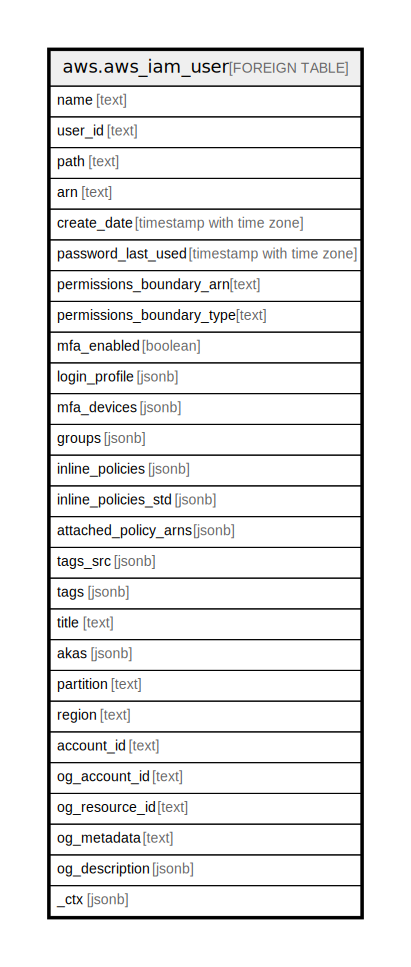

# aws.aws_iam_user

## Description

AWS IAM User

## Columns

| Name | Type | Default | Nullable | Children | Parents | Comment |
| ---- | ---- | ------- | -------- | -------- | ------- | ------- |
| name | text |  | true |  |  | The friendly name identifying the user. |
| user_id | text |  | true |  |  | The stable and unique string identifying the user. |
| path | text |  | true |  |  | The path to the user. |
| arn | text |  | true |  |  | The Amazon Resource Name (ARN) that identifies the user. |
| create_date | timestamp with time zone |  | true |  |  | The date and time, when the user was created. |
| password_last_used | timestamp with time zone |  | true |  |  | The date and time, when the user's password was last used to sign in to an AWS website. |
| permissions_boundary_arn | text |  | true |  |  | The ARN of the policy used to set the permissions boundary for the user. |
| permissions_boundary_type | text |  | true |  |  | The permissions boundary usage type that indicates what type of IAM resource is used as the permissions boundary for an entity. This data type can only have a value of Policy. |
| mfa_enabled | boolean |  | true |  |  | The MFA status of the user. |
| login_profile | jsonb |  | true |  |  | Contains the user name and password create date for a user. |
| mfa_devices | jsonb |  | true |  |  | A list of MFA devices attached to the user. |
| groups | jsonb |  | true |  |  | A list of groups attached to the user. |
| inline_policies | jsonb |  | true |  |  | A list of policy documents that are embedded as inline policies for the user. |
| inline_policies_std | jsonb |  | true |  |  | Inline policies in canonical form for the user. |
| attached_policy_arns | jsonb |  | true |  |  | A list of managed policies attached to the user. |
| tags_src | jsonb |  | true |  |  | A list of tags that are attached to the user. |
| tags | jsonb |  | true |  |  | A map of tags for the resource. |
| title | text |  | true |  |  | Title of the resource. |
| akas | jsonb |  | true |  |  | Array of globally unique identifier strings (also known as) for the resource. |
| partition | text |  | true |  |  | The AWS partition in which the resource is located (aws, aws-cn, or aws-us-gov). |
| region | text |  | true |  |  | The AWS Region in which the resource is located. |
| account_id | text |  | true |  |  | The AWS Account ID in which the resource is located. |
| og_account_id | text |  | true |  |  | The Platform Account ID in which the resource is located. |
| og_resource_id | text |  | true |  |  | The unique ID of the resource in opengovernance. |
| og_metadata | text |  | true |  |  | Platform Metadata of the AWS resource. |
| og_description | jsonb |  | true |  |  | The full model description of the resource |
| _ctx | jsonb |  | true |  |  | Steampipe context in JSON form, e.g. connection_name. |

## Relations

---

> Generated by [tbls](https://github.com/k1LoW/tbls)
