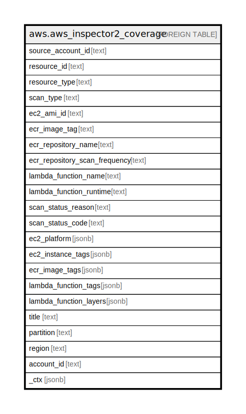

# aws.aws_inspector2_coverage

## Description

AWS Inspector2 Coverage

## Columns

| Name | Type | Default | Nullable | Children | Parents | Comment |
| ---- | ---- | ------- | -------- | -------- | ------- | ------- |
| source_account_id | text |  | true |  |  | The AWS Account ID in which the resource is located. |
| resource_id | text |  | true |  |  | The ID of the covered resource. |
| resource_type | text |  | true |  |  | The type of the covered resource. |
| scan_type | text |  | true |  |  | The Amazon Inspector scan type covering the resource. |
| ec2_ami_id | text |  | true |  |  | The ID of the Amazon Machine Image (AMI) used to launch the instance. |
| ecr_image_tag | text |  | true |  |  | Tags associated with the Amazon ECR image metadata. |
| ecr_repository_name | text |  | true |  |  | The name of the Amazon ECR repository. |
| ecr_repository_scan_frequency | text |  | true |  |  | The frequency of scans for an object that contains details about the repository an Amazon ECR image resides in. |
| lambda_function_name | text |  | true |  |  | The name of a function. |
| lambda_function_runtime | text |  | true |  |  | An AWS Lambda function's runtime. |
| scan_status_reason | text |  | true |  |  | The reason for the scan. |
| scan_status_code | text |  | true |  |  | The status code of the scan. |
| ec2_platform | jsonb |  | true |  |  | The platform of the instance. |
| ec2_instance_tags | jsonb |  | true |  |  | The tags attached to the instance. |
| ecr_image_tags | jsonb |  | true |  |  | Tags associated with the Amazon ECR image metadata. |
| lambda_function_tags | jsonb |  | true |  |  | The resource tags on an AWS Lambda function. |
| lambda_function_layers | jsonb |  | true |  |  | The layers for an AWS Lambda function. A Lambda function can have up to five layers. |
| title | text |  | true |  |  | Title of the resource. |
| partition | text |  | true |  |  | The AWS partition in which the resource is located (aws, aws-cn, or aws-us-gov). |
| region | text |  | true |  |  | The AWS Region in which the resource is located. |
| account_id | text |  | true |  |  | The AWS Account ID in which the resource is located. |
| _ctx | jsonb |  | true |  |  | Steampipe context in JSON form, e.g. connection_name. |

## Relations

---

> Generated by [tbls](https://github.com/k1LoW/tbls)
