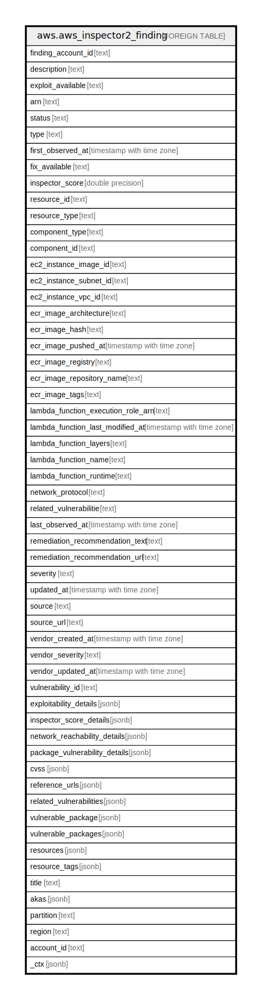

# aws.aws_inspector2_finding

## Description

AWS Inspector2 Finding

## Columns

| Name | Type | Default | Nullable | Children | Parents | Comment |
| ---- | ---- | ------- | -------- | -------- | ------- | ------- |
| finding_account_id | text |  | true |  |  | The Amazon Web Services account ID associated with the finding. |
| description | text |  | true |  |  | The description of the finding. |
| exploit_available | text |  | true |  |  | If a finding discovered in your environment has an exploit available. Valid values are: YES | NO. |
| arn | text |  | true |  |  | The Amazon Resource Number (ARN) of the finding. |
| status | text |  | true |  |  | The status of the finding. Valid values are: ACTIVE | SUPPRESSED | CLOSED. |
| type | text |  | true |  |  | The type of the finding. Valid values are: NETWORK_REACHABILITY | PACKAGE_VULNERABILITY. |
| first_observed_at | timestamp with time zone |  | true |  |  | The date and time that the finding was first observed. |
| fix_available | text |  | true |  |  | Details on whether a fix is available through a version update. Valid values are: YES | NO | PARTIAL. |
| inspector_score | double precision |  | true |  |  | The Amazon Inspector score given to the finding. |
| resource_id | text |  | true |  |  | The ID of the resource. |
| resource_type | text |  | true |  |  | The resource type supported by AWS. |
| component_type | text |  | true |  |  | The component type. |
| component_id | text |  | true |  |  | The component ID of the resource. |
| ec2_instance_image_id | text |  | true |  |  | The Amazon EC2 instance image ID. |
| ec2_instance_subnet_id | text |  | true |  |  | The Amazon EC2 instance subnet ID. |
| ec2_instance_vpc_id | text |  | true |  |  | The Amazon EC2 instance VPC ID. |
| ecr_image_architecture | text |  | true |  |  | The Amazon ECR image architecture. |
| ecr_image_hash | text |  | true |  |  | The Amazon ECR image hash. |
| ecr_image_pushed_at | timestamp with time zone |  | true |  |  | The Amazon ECR image push date and time. |
| ecr_image_registry | text |  | true |  |  | The Amazon ECR registry. |
| ecr_image_repository_name | text |  | true |  |  | The name of the Amazon ECR repository. |
| ecr_image_tags | text |  | true |  |  | The tags attached to the Amazon ECR container image. |
| lambda_function_execution_role_arn | text |  | true |  |  | The AWS Lambda function execution role ARN. |
| lambda_function_last_modified_at | timestamp with time zone |  | true |  |  | The AWS Lambda functions the date and time that a user last updated the configuration. |
| lambda_function_layers | text |  | true |  |  | The AWS Lambda function layer. |
| lambda_function_name | text |  | true |  |  | The AWS Lambda function name. |
| lambda_function_runtime | text |  | true |  |  | The AWS Lambda function runtime environment. |
| network_protocol | text |  | true |  |  | The ingress source addresse. |
| related_vulnerabilitie | text |  | true |  |  | The related vulnerabilitie. |
| last_observed_at | timestamp with time zone |  | true |  |  | The date and time that the finding was last observed. |
| remediation_recommendation_text | text |  | true |  |  | The recommended course of action to remediate the finding. |
| remediation_recommendation_url | text |  | true |  |  | The URL address to the CVE remediation recommendations. |
| severity | text |  | true |  |  | The severity of the finding. Valid values are: INFORMATIONAL | LOW | MEDIUM | HIGH | CRITICAL | UNTRIAGED. |
| updated_at | timestamp with time zone |  | true |  |  | The date and time the finding was last updated at. |
| source | text |  | true |  |  | The source of the vulnerability information. |
| source_url | text |  | true |  |  | A URL to the source of the vulnerability information. |
| vendor_created_at | timestamp with time zone |  | true |  |  | The date and time that this vulnerability was first added to the vendor’s database. |
| vendor_severity | text |  | true |  |  | The severity the vendor has given to this vulnerability type. |
| vendor_updated_at | timestamp with time zone |  | true |  |  | The date and time the vendor last updated this vulnerability in their database. |
| vulnerability_id | text |  | true |  |  | The ID given to this vulnerability. |
| exploitability_details | jsonb |  | true |  |  | The details of an exploit available for a finding discovered in your environment. |
| inspector_score_details | jsonb |  | true |  |  | An object that contains details of the Amazon Inspector score. |
| network_reachability_details | jsonb |  | true |  |  | An object that contains the details of a network reachability finding. |
| package_vulnerability_details | jsonb |  | true |  |  | An object that contains the details of a package vulnerability finding. |
| cvss | jsonb |  | true |  |  | An object that contains details about the CVSS score of a finding. |
| reference_urls | jsonb |  | true |  |  | One or more URLs that contain details about this vulnerability type. |
| related_vulnerabilities | jsonb |  | true |  |  | One or more vulnerabilities related to the one identified in this finding. |
| vulnerable_package | jsonb |  | true |  |  | The package impacted by this vulnerability. |
| vulnerable_packages | jsonb |  | true |  |  | The packages impacted by this vulnerability. |
| resources | jsonb |  | true |  |  | Contains information on the resources involved in a finding. |
| resource_tags | jsonb |  | true |  |  | Details on the resource tags used to filter findings. |
| title | text |  | true |  |  | The title of the finding. |
| akas | jsonb |  | true |  |  | Array of globally unique identifier strings (also known as) for the resource. |
| partition | text |  | true |  |  | The AWS partition in which the resource is located (aws, aws-cn, or aws-us-gov). |
| region | text |  | true |  |  | The AWS Region in which the resource is located. |
| account_id | text |  | true |  |  | The AWS Account ID in which the resource is located. |
| _ctx | jsonb |  | true |  |  | Steampipe context in JSON form, e.g. connection_name. |

## Relations

---

> Generated by [tbls](https://github.com/k1LoW/tbls)
