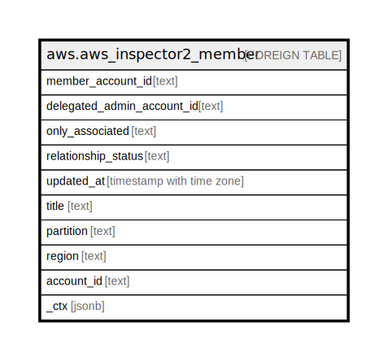

# aws.aws_inspector2_member

## Description

AWS Inspector2 Member

## Columns

| Name | Type | Default | Nullable | Children | Parents | Comment |
| ---- | ---- | ------- | -------- | -------- | ------- | ------- |
| member_account_id | text |  | true |  |  | The AWS Account ID in which the resource is located. |
| delegated_admin_account_id | text |  | true |  |  | The Amazon Web Services account ID of the Amazon Inspector delegated administrator for this member account. |
| only_associated | text |  | true |  |  | Specifies whether to list only currently associated members if True or to list all members within the organization if False. |
| relationship_status | text |  | true |  |  | The status of the member account. Valid values are: CREATED | INVITED | DISABLED | ENABLED | REMOVED | RESIGNED | DELETED | EMAIL_VERIFICATION_IN_PROGRESS | EMAIL_VERIFICATION_FAILED | REGION_DISABLED | ACCOUNT_SUSPENDED | CANNOT_CREATE_DETECTOR_IN_ORG_MASTER. |
| updated_at | timestamp with time zone |  | true |  |  | A timestamp showing when the status of this member was last updated. |
| title | text |  | true |  |  | Title of the resource. |
| partition | text |  | true |  |  | The AWS partition in which the resource is located (aws, aws-cn, or aws-us-gov). |
| region | text |  | true |  |  | The AWS Region in which the resource is located. |
| account_id | text |  | true |  |  | The AWS Account ID in which the resource is located. |
| _ctx | jsonb |  | true |  |  | Steampipe context in JSON form, e.g. connection_name. |

## Relations

---

> Generated by [tbls](https://github.com/k1LoW/tbls)
