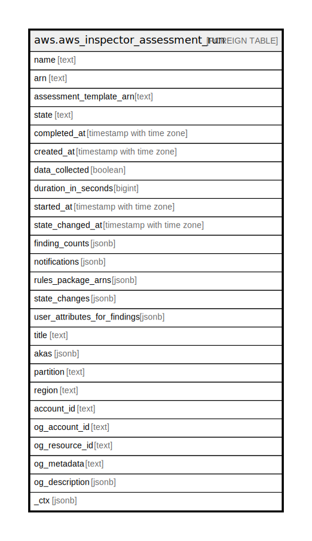

# aws.aws_inspector_assessment_run

## Description

AWS Inspector Assessment Run

## Columns

| Name | Type | Default | Nullable | Children | Parents | Comment |
| ---- | ---- | ------- | -------- | -------- | ------- | ------- |
| name | text |  | true |  |  | The auto-generated name for the assessment run. |
| arn | text |  | true |  |  | The ARN of the assessment run. |
| assessment_template_arn | text |  | true |  |  | The ARN of the assessment template that is associated with the assessment run. |
| state | text |  | true |  |  | The state of the assessment run. |
| completed_at | timestamp with time zone |  | true |  |  | The assessment run completion time that corresponds to the rules packages evaluation completion time or failure. |
| created_at | timestamp with time zone |  | true |  |  | The time when StartAssessmentRun was called. |
| data_collected | boolean |  | true |  |  | Boolean value (true or false) that specifies whether the process of collecting data from the agents is completed. |
| duration_in_seconds | bigint |  | true |  |  | The duration of the assessment run. |
| started_at | timestamp with time zone |  | true |  |  | The time when StartAssessmentRun was called. |
| state_changed_at | timestamp with time zone |  | true |  |  | The last time when the assessment run's state changed. |
| finding_counts | jsonb |  | true |  |  | Provides a total count of generated findings per severity. |
| notifications | jsonb |  | true |  |  | A list of notifications for the event subscriptions. |
| rules_package_arns | jsonb |  | true |  |  | The rules packages selected for the assessment run. |
| state_changes | jsonb |  | true |  |  | A list of the assessment run state changes. |
| user_attributes_for_findings | jsonb |  | true |  |  | The user-defined attributes that are assigned to every generated finding. |
| title | text |  | true |  |  | Title of the resource. |
| akas | jsonb |  | true |  |  | Array of globally unique identifier strings (also known as) for the resource. |
| partition | text |  | true |  |  | The AWS partition in which the resource is located (aws, aws-cn, or aws-us-gov). |
| region | text |  | true |  |  | The AWS Region in which the resource is located. |
| account_id | text |  | true |  |  | The AWS Account ID in which the resource is located. |
| og_account_id | text |  | true |  |  | The Platform Account ID in which the resource is located. |
| og_resource_id | text |  | true |  |  | The unique ID of the resource in opengovernance. |
| og_metadata | text |  | true |  |  | Platform Metadata of the AWS resource. |
| og_description | jsonb |  | true |  |  | The full model description of the resource |
| _ctx | jsonb |  | true |  |  | Steampipe context in JSON form, e.g. connection_name. |

## Relations

---

> Generated by [tbls](https://github.com/k1LoW/tbls)
