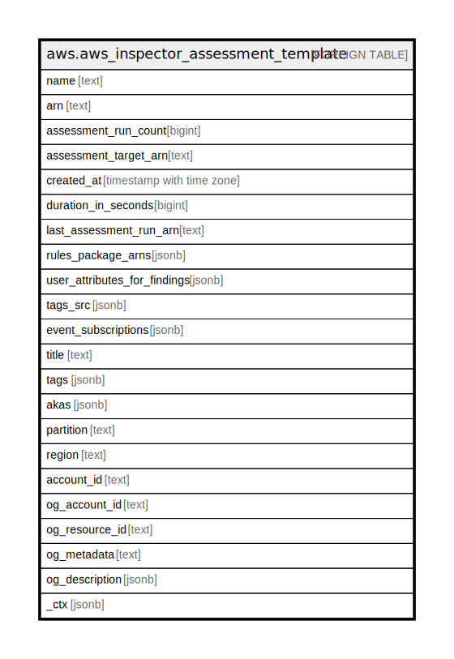

# aws.aws_inspector_assessment_template

## Description

AWS Inspector Assessment Template

## Columns

| Name | Type | Default | Nullable | Children | Parents | Comment |
| ---- | ---- | ------- | -------- | -------- | ------- | ------- |
| name | text |  | true |  |  | The name of the assessment template. |
| arn | text |  | true |  |  | The ARN of the assessment template. |
| assessment_run_count | bigint |  | true |  |  | The number of existing assessment runs associated with this assessment template. |
| assessment_target_arn | text |  | true |  |  | The ARN of the assessment target that corresponds to this assessment template. |
| created_at | timestamp with time zone |  | true |  |  | The time at which the assessment template is created. |
| duration_in_seconds | bigint |  | true |  |  | The duration in seconds specified for this assessment template. |
| last_assessment_run_arn | text |  | true |  |  | The Amazon Resource Name (ARN) of the most recent assessment run associated with this assessment template. |
| rules_package_arns | jsonb |  | true |  |  | The rules packages that are specified for this assessment template. |
| user_attributes_for_findings | jsonb |  | true |  |  | The user-defined attributes that are assigned to every generated finding from the assessment run that uses this assessment template. |
| tags_src | jsonb |  | true |  |  | A list of tags associated with the Assessment Template. |
| event_subscriptions | jsonb |  | true |  |  | A list of event subscriptions associated with the Assessment Template. |
| title | text |  | true |  |  | Title of the resource. |
| tags | jsonb |  | true |  |  | A map of tags for the resource. |
| akas | jsonb |  | true |  |  | Array of globally unique identifier strings (also known as) for the resource. |
| partition | text |  | true |  |  | The AWS partition in which the resource is located (aws, aws-cn, or aws-us-gov). |
| region | text |  | true |  |  | The AWS Region in which the resource is located. |
| account_id | text |  | true |  |  | The AWS Account ID in which the resource is located. |
| og_account_id | text |  | true |  |  | The Platform Account ID in which the resource is located. |
| og_resource_id | text |  | true |  |  | The unique ID of the resource in opengovernance. |
| og_metadata | text |  | true |  |  | Platform Metadata of the AWS resource. |
| og_description | jsonb |  | true |  |  | The full model description of the resource |
| _ctx | jsonb |  | true |  |  | Steampipe context in JSON form, e.g. connection_name. |

## Relations

---

> Generated by [tbls](https://github.com/k1LoW/tbls)
