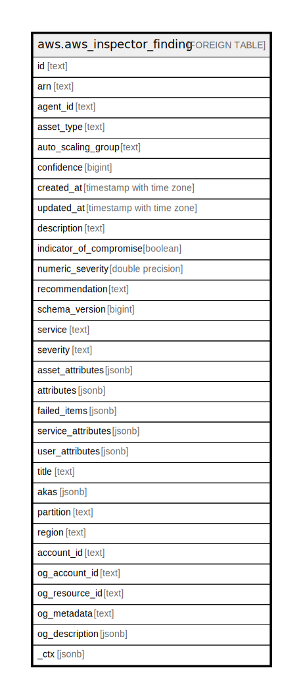

# aws.aws_inspector_finding

## Description

AWS Inspector Finding

## Columns

| Name | Type | Default | Nullable | Children | Parents | Comment |
| ---- | ---- | ------- | -------- | -------- | ------- | ------- |
| id | text |  | true |  |  | The ID of the finding. |
| arn | text |  | true |  |  | The ARN that specifies the finding. |
| agent_id | text |  | true |  |  | The ID of the agent that is installed on the EC2 instance where the finding is generated. |
| asset_type | text |  | true |  |  | The type of the host from which the finding is generated. |
| auto_scaling_group | text |  | true |  |  | The Auto Scaling group of the EC2 instance where the finding is generated. |
| confidence | bigint |  | true |  |  | This data element is currently not used. |
| created_at | timestamp with time zone |  | true |  |  | The time when the finding was generated. |
| updated_at | timestamp with time zone |  | true |  |  | The time when AddAttributesToFindings is called. |
| description | text |  | true |  |  | The description of the finding. |
| indicator_of_compromise | boolean |  | true |  |  | This data element is currently not used. |
| numeric_severity | double precision |  | true |  |  | The numeric value of the finding severity. |
| recommendation | text |  | true |  |  | The recommendation for the finding. |
| schema_version | bigint |  | true |  |  | The schema version of this data type. |
| service | text |  | true |  |  | The data element is set to 'Inspector'. |
| severity | text |  | true |  |  | The finding severity. Values can be set to High, Medium, Low, and Informational. |
| asset_attributes | jsonb |  | true |  |  | A collection of attributes of the host from which the finding is generated. |
| attributes | jsonb |  | true |  |  | The system-defined attributes for the finding. |
| failed_items | jsonb |  | true |  |  | Attributes details that cannot be described. An error code is provided for each failed item. |
| service_attributes | jsonb |  | true |  |  | This data type is used in the Finding data type. |
| user_attributes | jsonb |  | true |  |  | The user-defined attributes that are assigned to the finding. |
| title | text |  | true |  |  | The name of the finding. |
| akas | jsonb |  | true |  |  | Array of globally unique identifier strings (also known as) for the resource. |
| partition | text |  | true |  |  | The AWS partition in which the resource is located (aws, aws-cn, or aws-us-gov). |
| region | text |  | true |  |  | The AWS Region in which the resource is located. |
| account_id | text |  | true |  |  | The AWS Account ID in which the resource is located. |
| og_account_id | text |  | true |  |  | The Platform Account ID in which the resource is located. |
| og_resource_id | text |  | true |  |  | The unique ID of the resource in opengovernance. |
| og_metadata | text |  | true |  |  | Platform Metadata of the AWS resource. |
| og_description | jsonb |  | true |  |  | The full model description of the resource |
| _ctx | jsonb |  | true |  |  | Steampipe context in JSON form, e.g. connection_name. |

## Relations

---

> Generated by [tbls](https://github.com/k1LoW/tbls)
