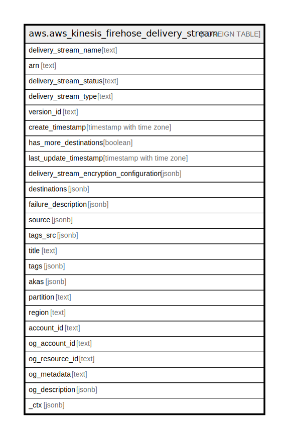

# aws.aws_kinesis_firehose_delivery_stream

## Description

AWS Kinesis Firehose Delivery Stream

## Columns

| Name | Type | Default | Nullable | Children | Parents | Comment |
| ---- | ---- | ------- | -------- | -------- | ------- | ------- |
| delivery_stream_name | text |  | true |  |  | The name of the delivery stream. |
| arn | text |  | true |  |  | The Amazon Resource Name (ARN) of the delivery stream. |
| delivery_stream_status | text |  | true |  |  | The server-side encryption type used on the stream. |
| delivery_stream_type | text |  | true |  |  | The delivery stream type. |
| version_id | text |  | true |  |  | The version id of the stream. Each time the destination is updated for a delivery stream, the version ID is changed, and the current version ID is required when updating the destination |
| create_timestamp | timestamp with time zone |  | true |  |  | The date and time that the delivery stream was created. |
| has_more_destinations | boolean |  | true |  |  | Indicates whether there are more destinations available to list. |
| last_update_timestamp | timestamp with time zone |  | true |  |  | The date and time that the delivery stream was last updated. |
| delivery_stream_encryption_configuration | jsonb |  | true |  |  | Indicates the server-side encryption (SSE) status for the delivery stream. |
| destinations | jsonb |  | true |  |  | The destinations for the stream. |
| failure_description | jsonb |  | true |  |  | Provides details in case one of the following operations fails due to an error related to KMS: CreateDeliveryStream, DeleteDeliveryStream, StartDeliveryStreamEncryption,StopDeliveryStreamEncryption. |
| source | jsonb |  | true |  |  | If the DeliveryStreamType parameter is KinesisStreamAsSource, a SourceDescription object describing the source Kinesis data stream. |
| tags_src | jsonb |  | true |  |  | A list of tags associated with the delivery stream. |
| title | text |  | true |  |  | Title of the resource. |
| tags | jsonb |  | true |  |  | A map of tags for the resource. |
| akas | jsonb |  | true |  |  | Array of globally unique identifier strings (also known as) for the resource. |
| partition | text |  | true |  |  | The AWS partition in which the resource is located (aws, aws-cn, or aws-us-gov). |
| region | text |  | true |  |  | The AWS Region in which the resource is located. |
| account_id | text |  | true |  |  | The AWS Account ID in which the resource is located. |
| og_account_id | text |  | true |  |  | The Platform Account ID in which the resource is located. |
| og_resource_id | text |  | true |  |  | The unique ID of the resource in opengovernance. |
| og_metadata | text |  | true |  |  | Platform Metadata of the AWS resource. |
| og_description | jsonb |  | true |  |  | The full model description of the resource |
| _ctx | jsonb |  | true |  |  | Steampipe context in JSON form, e.g. connection_name. |

## Relations

---

> Generated by [tbls](https://github.com/k1LoW/tbls)
