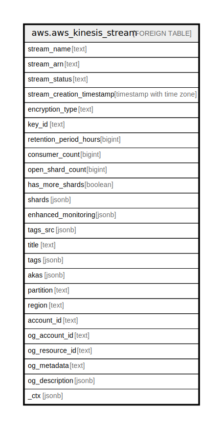

# aws.aws_kinesis_stream

## Description

AWS Kinesis Stream

## Columns

| Name | Type | Default | Nullable | Children | Parents | Comment |
| ---- | ---- | ------- | -------- | -------- | ------- | ------- |
| stream_name | text |  | true |  |  | The name of the stream being described. |
| stream_arn | text |  | true |  |  | The Amazon Resource Name (ARN) for the stream being described. |
| stream_status | text |  | true |  |  | The current status of the stream being described. |
| stream_creation_timestamp | timestamp with time zone |  | true |  |  | The approximate time that the stream was created. |
| encryption_type | text |  | true |  |  | The server-side encryption type used on the stream. |
| key_id | text |  | true |  |  | The GUID for the customer-managed AWS KMS key to use for encryption. |
| retention_period_hours | bigint |  | true |  |  | The current retention period, in hours. |
| consumer_count | bigint |  | true |  |  | The number of enhanced fan-out consumers registered with the stream. |
| open_shard_count | bigint |  | true |  |  | The number of open shards in the stream. |
| has_more_shards | boolean |  | true |  |  | If set to true, more shards in the stream are available to describe. |
| shards | jsonb |  | true |  |  | The shards that comprise the stream. |
| enhanced_monitoring | jsonb |  | true |  |  | Represents the current enhanced monitoring settings of the stream. |
| tags_src | jsonb |  | true |  |  | A list of tags associated with the stream. |
| title | text |  | true |  |  | Title of the resource. |
| tags | jsonb |  | true |  |  | A map of tags for the resource. |
| akas | jsonb |  | true |  |  | Array of globally unique identifier strings (also known as) for the resource. |
| partition | text |  | true |  |  | The AWS partition in which the resource is located (aws, aws-cn, or aws-us-gov). |
| region | text |  | true |  |  | The AWS Region in which the resource is located. |
| account_id | text |  | true |  |  | The AWS Account ID in which the resource is located. |
| og_account_id | text |  | true |  |  | The Platform Account ID in which the resource is located. |
| og_resource_id | text |  | true |  |  | The unique ID of the resource in opengovernance. |
| og_metadata | text |  | true |  |  | Platform Metadata of the AWS resource. |
| og_description | jsonb |  | true |  |  | The full model description of the resource |
| _ctx | jsonb |  | true |  |  | Steampipe context in JSON form, e.g. connection_name. |

## Relations

---

> Generated by [tbls](https://github.com/k1LoW/tbls)
