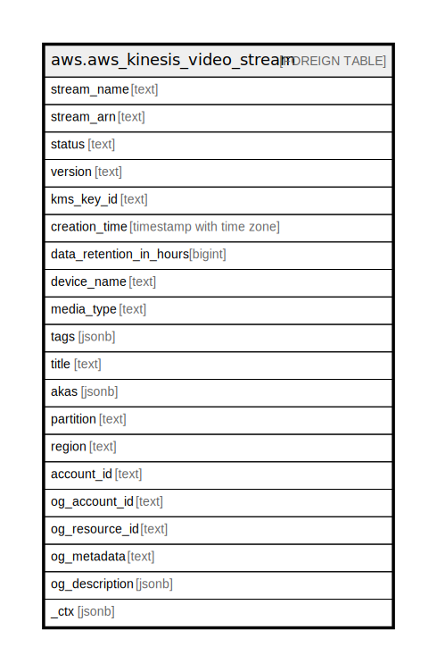

# aws.aws_kinesis_video_stream

## Description

AWS Kinesis Video Stream

## Columns

| Name | Type | Default | Nullable | Children | Parents | Comment |
| ---- | ---- | ------- | -------- | -------- | ------- | ------- |
| stream_name | text |  | true |  |  | The name of the stream. |
| stream_arn | text |  | true |  |  | The Amazon Resource Name (ARN) of the stream. |
| status | text |  | true |  |  | The status of the stream. |
| version | text |  | true |  |  | The version of the stream. |
| kms_key_id | text |  | true |  |  | The ID of the AWS Key Management Service (AWS KMS) key that Kinesis Video Streams uses to encrypt data on the stream. |
| creation_time | timestamp with time zone |  | true |  |  | A time stamp that indicates when the stream was created. |
| data_retention_in_hours | bigint |  | true |  |  | How long the stream retains data, in hours. |
| device_name | text |  | true |  |  | The name of the device that is associated with the stream. |
| media_type | text |  | true |  |  | The MediaType of the stream. |
| tags | jsonb |  | true |  |  | A map of tags for the resource. |
| title | text |  | true |  |  | Title of the resource. |
| akas | jsonb |  | true |  |  | Array of globally unique identifier strings (also known as) for the resource. |
| partition | text |  | true |  |  | The AWS partition in which the resource is located (aws, aws-cn, or aws-us-gov). |
| region | text |  | true |  |  | The AWS Region in which the resource is located. |
| account_id | text |  | true |  |  | The AWS Account ID in which the resource is located. |
| og_account_id | text |  | true |  |  | The Platform Account ID in which the resource is located. |
| og_resource_id | text |  | true |  |  | The unique ID of the resource in opengovernance. |
| og_metadata | text |  | true |  |  | Platform Metadata of the AWS resource. |
| og_description | jsonb |  | true |  |  | The full model description of the resource |
| _ctx | jsonb |  | true |  |  | Steampipe context in JSON form, e.g. connection_name. |

## Relations

---

> Generated by [tbls](https://github.com/k1LoW/tbls)
