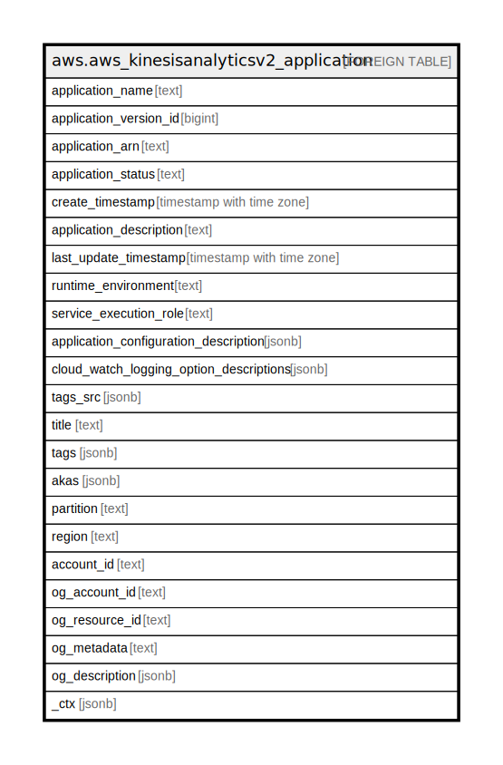

# aws.aws_kinesisanalyticsv2_application

## Description

AWS Kinesis Analytics V2 Application

## Columns

| Name | Type | Default | Nullable | Children | Parents | Comment |
| ---- | ---- | ------- | -------- | -------- | ------- | ------- |
| application_name | text |  | true |  |  | The name of the application. |
| application_version_id | bigint |  | true |  |  | Provides the current application version. |
| application_arn | text |  | true |  |  | The ARN of the application. |
| application_status | text |  | true |  |  | The status of the application. |
| create_timestamp | timestamp with time zone |  | true |  |  | The current timestamp when the application was created. |
| application_description | text |  | true |  |  | The description of the application. |
| last_update_timestamp | timestamp with time zone |  | true |  |  | The current timestamp when the application was last updated. |
| runtime_environment | text |  | true |  |  | The runtime environment for the application. |
| service_execution_role | text |  | true |  |  | Specifies the IAM role that the application uses to access external resources. |
| application_configuration_description | jsonb |  | true |  |  | Provides details about the application's Java, SQL, or Scala code and starting parameters. |
| cloud_watch_logging_option_descriptions | jsonb |  | true |  |  | Describes the application Amazon CloudWatch logging options. |
| tags_src | jsonb |  | true |  |  | The key-value tags assigned to the application. |
| title | text |  | true |  |  | Title of the resource. |
| tags | jsonb |  | true |  |  | A map of tags for the resource. |
| akas | jsonb |  | true |  |  | Array of globally unique identifier strings (also known as) for the resource. |
| partition | text |  | true |  |  | The AWS partition in which the resource is located (aws, aws-cn, or aws-us-gov). |
| region | text |  | true |  |  | The AWS Region in which the resource is located. |
| account_id | text |  | true |  |  | The AWS Account ID in which the resource is located. |
| og_account_id | text |  | true |  |  | The Platform Account ID in which the resource is located. |
| og_resource_id | text |  | true |  |  | The unique ID of the resource in opengovernance. |
| og_metadata | text |  | true |  |  | Platform Metadata of the AWS resource. |
| og_description | jsonb |  | true |  |  | The full model description of the resource |
| _ctx | jsonb |  | true |  |  | Steampipe context in JSON form, e.g. connection_name. |

## Relations

---

> Generated by [tbls](https://github.com/k1LoW/tbls)
