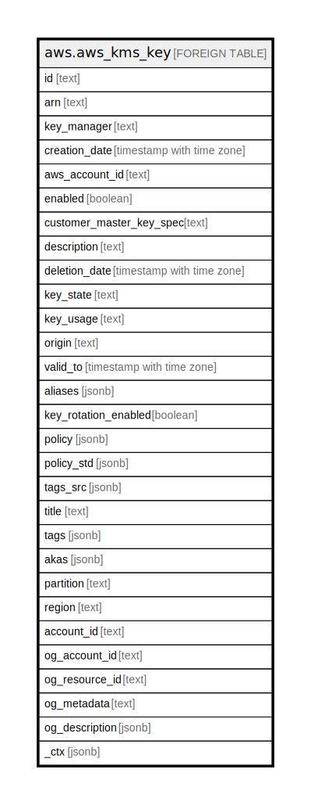

# aws.aws_kms_key

## Description

AWS KMS Key

## Columns

| Name | Type | Default | Nullable | Children | Parents | Comment |
| ---- | ---- | ------- | -------- | -------- | ------- | ------- |
| id | text |  | true |  |  | Unique identifier of the key. |
| arn | text |  | true |  |  | ARN of the key. |
| key_manager | text |  | true |  |  | The manager of the CMK. CMKs in your AWS account are either customer managed or AWS managed. |
| creation_date | timestamp with time zone |  | true |  |  | The date and time when the CMK was created. |
| aws_account_id | text |  | true |  |  | The twelve-digit account ID of the AWS account that owns the CMK. |
| enabled | boolean |  | true |  |  | Specifies whether the CMK is enabled. When KeyState is Enabled this value is true, otherwise it is false. |
| customer_master_key_spec | text |  | true |  |  | Describes the type of key material in the CMK. |
| description | text |  | true |  |  | The description of the CMK. |
| deletion_date | timestamp with time zone |  | true |  |  | The date and time after which AWS KMS deletes the CMK. |
| key_state | text |  | true |  |  | The current status of the CMK. For more information about how key state affects the use of a CMK, see [Key state: Effect on your CMK](https://docs.aws.amazon.com/kms/latest/developerguide/key-state.html). |
| key_usage | text |  | true |  |  | The [cryptographic operations](https://docs.aws.amazon.com/kms/latest/developerguide/concepts.html#cryptographic-operations) for which you can use the CMK. |
| origin | text |  | true |  |  | The source of the CMK's key material. When this value is AWS_KMS, AWS KMS created the key material. When this value is EXTERNAL, the key material was imported from your existing key management infrastructure or the CMK lacks key material. When this value is AWS_CLOUDHSM, the key material was created in the AWS CloudHSM cluster associated with a custom key store. |
| valid_to | timestamp with time zone |  | true |  |  | The time at which the imported key material expires. |
| aliases | jsonb |  | true |  |  | A list of aliases for the key. |
| key_rotation_enabled | boolean |  | true |  |  | A Boolean value that specifies whether key rotation is enabled. |
| policy | jsonb |  | true |  |  | A key policy document in JSON format. |
| policy_std | jsonb |  | true |  |  | Contains the policy in a canonical form for easier searching. |
| tags_src | jsonb |  | true |  |  | A list of tags attached to key. |
| title | text |  | true |  |  | Title of the resource. |
| tags | jsonb |  | true |  |  | A map of tags for the resource. |
| akas | jsonb |  | true |  |  | Array of globally unique identifier strings (also known as) for the resource. |
| partition | text |  | true |  |  | The AWS partition in which the resource is located (aws, aws-cn, or aws-us-gov). |
| region | text |  | true |  |  | The AWS Region in which the resource is located. |
| account_id | text |  | true |  |  | The AWS Account ID in which the resource is located. |
| og_account_id | text |  | true |  |  | The Platform Account ID in which the resource is located. |
| og_resource_id | text |  | true |  |  | The unique ID of the resource in opengovernance. |
| og_metadata | text |  | true |  |  | Platform Metadata of the AWS resource. |
| og_description | jsonb |  | true |  |  | The full model description of the resource |
| _ctx | jsonb |  | true |  |  | Steampipe context in JSON form, e.g. connection_name. |

## Relations

---

> Generated by [tbls](https://github.com/k1LoW/tbls)
