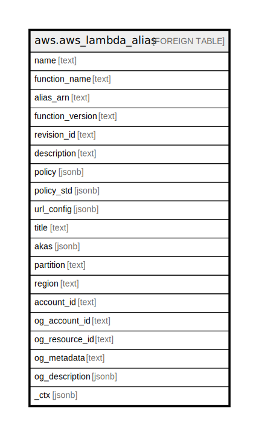

# aws.aws_lambda_alias

## Description

AWS Lambda Alias

## Columns

| Name | Type | Default | Nullable | Children | Parents | Comment |
| ---- | ---- | ------- | -------- | -------- | ------- | ------- |
| name | text |  | true |  |  | The name of the alias. |
| function_name | text |  | true |  |  | The name of the function. |
| alias_arn | text |  | true |  |  | The Amazon Resource Name (ARN) of the alias. |
| function_version | text |  | true |  |  | The function version that the alias invokes. |
| revision_id | text |  | true |  |  | A unique identifier that changes when you update the alias. |
| description | text |  | true |  |  | A description of the alias. |
| policy | jsonb |  | true |  |  | Contains the resource-based policy. |
| policy_std | jsonb |  | true |  |  | Contains the contents of the resource-based policy in a canonical form for easier searching. |
| url_config | jsonb |  | true |  |  | The function URL configuration details of the alias. |
| title | text |  | true |  |  | Title of the resource. |
| akas | jsonb |  | true |  |  | Array of globally unique identifier strings (also known as) for the resource. |
| partition | text |  | true |  |  | The AWS partition in which the resource is located (aws, aws-cn, or aws-us-gov). |
| region | text |  | true |  |  | The AWS Region in which the resource is located. |
| account_id | text |  | true |  |  | The AWS Account ID in which the resource is located. |
| og_account_id | text |  | true |  |  | The Platform Account ID in which the resource is located. |
| og_resource_id | text |  | true |  |  | The unique ID of the resource in opengovernance. |
| og_metadata | text |  | true |  |  | Platform Metadata of the AWS resource. |
| og_description | jsonb |  | true |  |  | The full model description of the resource |
| _ctx | jsonb |  | true |  |  | Steampipe context in JSON form, e.g. connection_name. |

## Relations

---

> Generated by [tbls](https://github.com/k1LoW/tbls)
