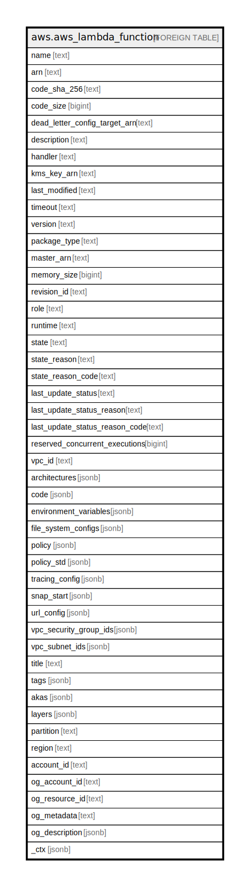

# aws.aws_lambda_function

## Description

AWS Lambda Function

## Columns

| Name | Type | Default | Nullable | Children | Parents | Comment |
| ---- | ---- | ------- | -------- | -------- | ------- | ------- |
| name | text |  | true |  |  | The name of the function. |
| arn | text |  | true |  |  | The function's Amazon Resource Name (ARN). |
| code_sha_256 | text |  | true |  |  | The SHA256 hash of the function's deployment package. |
| code_size | bigint |  | true |  |  | The size of the function's deployment package, in bytes. |
| dead_letter_config_target_arn | text |  | true |  |  | The Amazon Resource Name (ARN) of an Amazon SQS queue or Amazon SNS topic. |
| description | text |  | true |  |  | The function's description. |
| handler | text |  | true |  |  | The function that Lambda calls to begin executing your function. |
| kms_key_arn | text |  | true |  |  | The KMS key that's used to encrypt the function's environment variables. This key is only returned if you've configured a customer managed CMK. |
| last_modified | text |  | true |  |  | The date and time that the function was last updated. |
| timeout | text |  | true |  |  | The amount of time in seconds that Lambda allows a function to run before stopping it. |
| version | text |  | true |  |  | The version of the Lambda function. |
| package_type | text |  | true |  |  | The type of deployment package. |
| master_arn | text |  | true |  |  | For Lambda@Edge functions, the ARN of the master function. |
| memory_size | bigint |  | true |  |  | The memory that's allocated to the function. |
| revision_id | text |  | true |  |  | The latest updated revision of the function or alias. |
| role | text |  | true |  |  | The function's execution role. |
| runtime | text |  | true |  |  | The runtime environment for the Lambda function. |
| state | text |  | true |  |  | The current state of the function. |
| state_reason | text |  | true |  |  | The reason for the function's current state. |
| state_reason_code | text |  | true |  |  | The reason code for the function's current state. |
| last_update_status | text |  | true |  |  | The status of the last update that was performed on the function. |
| last_update_status_reason | text |  | true |  |  | The reason for the last update that was performed on the function. |
| last_update_status_reason_code | text |  | true |  |  | The reason code for the last update that was performed on the function. |
| reserved_concurrent_executions | bigint |  | true |  |  | The number of concurrent executions that are reserved for this function. |
| vpc_id | text |  | true |  |  | The VPC ID that is attached to Lambda function. |
| architectures | jsonb |  | true |  |  | The instruction set architecture that the function supports. Architecture is a string array with one of the valid values. |
| code | jsonb |  | true |  |  | The deployment package of the function or version. |
| environment_variables | jsonb |  | true |  |  | The environment variables that are accessible from function code during execution. |
| file_system_configs | jsonb |  | true |  |  | Connection settings for an Amazon EFS file system. |
| policy | jsonb |  | true |  |  | The resource-based iam policy of Lambda function. |
| policy_std | jsonb |  | true |  |  | Contains the policy in a canonical form for easier searching. |
| tracing_config | jsonb |  | true |  |  | The function's X-Ray tracing configuration. |
| snap_start | jsonb |  | true |  |  | Set ApplyOn to PublishedVersions to create a snapshot of the initialized execution environment when you publish a function version. |
| url_config | jsonb |  | true |  |  | The function URL configuration details of the function. |
| vpc_security_group_ids | jsonb |  | true |  |  | A list of VPC security groups IDs attached to Lambda function. |
| vpc_subnet_ids | jsonb |  | true |  |  | A list of VPC subnet IDs attached to Lambda function. |
| title | text |  | true |  |  | Title of the resource. |
| tags | jsonb |  | true |  |  | A map of tags for the resource. |
| akas | jsonb |  | true |  |  | Array of globally unique identifier strings (also known as) for the resource. |
| layers | jsonb |  | true |  |  |  |
| partition | text |  | true |  |  | The AWS partition in which the resource is located (aws, aws-cn, or aws-us-gov). |
| region | text |  | true |  |  | The AWS Region in which the resource is located. |
| account_id | text |  | true |  |  | The AWS Account ID in which the resource is located. |
| og_account_id | text |  | true |  |  | The Platform Account ID in which the resource is located. |
| og_resource_id | text |  | true |  |  | The unique ID of the resource in opengovernance. |
| og_metadata | text |  | true |  |  | Platform Metadata of the AWS resource. |
| og_description | jsonb |  | true |  |  | The full model description of the resource |
| _ctx | jsonb |  | true |  |  | Steampipe context in JSON form, e.g. connection_name. |

## Relations

---

> Generated by [tbls](https://github.com/k1LoW/tbls)
