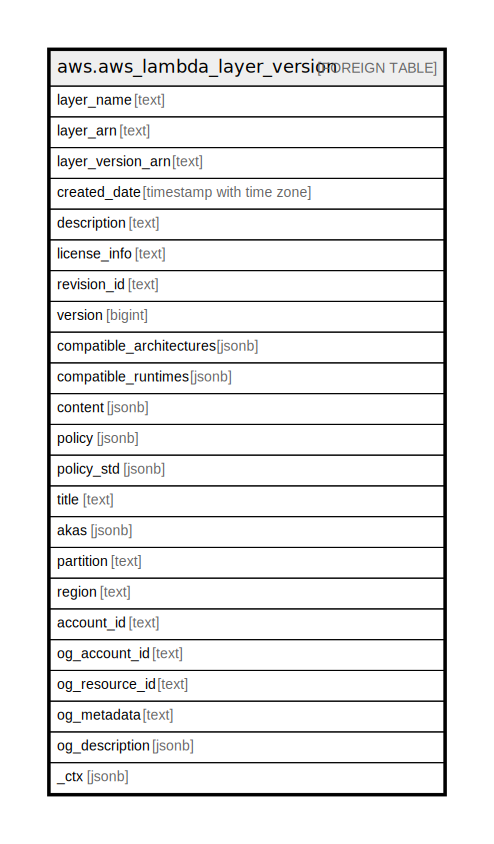

# aws.aws_lambda_layer_version

## Description

AWS Lambda Layer Version

## Columns

| Name | Type | Default | Nullable | Children | Parents | Comment |
| ---- | ---- | ------- | -------- | -------- | ------- | ------- |
| layer_name | text |  | true |  |  | The name of the layer. |
| layer_arn | text |  | true |  |  | The ARN of the layer. |
| layer_version_arn | text |  | true |  |  | The ARN of the layer version. |
| created_date | timestamp with time zone |  | true |  |  | The date that the version was created, in ISO 8601 format. |
| description | text |  | true |  |  | The description of the version. |
| license_info | text |  | true |  |  | The layer's open-source license. |
| revision_id | text |  | true |  |  | A unique identifier for the current revision of the policy. |
| version | bigint |  | true |  |  | The version number. |
| compatible_architectures | jsonb |  | true |  |  | A list of compatible instruction set architectures. |
| compatible_runtimes | jsonb |  | true |  |  | The layer's compatible runtimes. |
| content | jsonb |  | true |  |  | Details about the layer version. |
| policy | jsonb |  | true |  |  | The policy document. |
| policy_std | jsonb |  | true |  |  | Contains the policy document in a canonical form for easier searching. |
| title | text |  | true |  |  | Title of the resource. |
| akas | jsonb |  | true |  |  | Array of globally unique identifier strings (also known as) for the resource. |
| partition | text |  | true |  |  | The AWS partition in which the resource is located (aws, aws-cn, or aws-us-gov). |
| region | text |  | true |  |  | The AWS Region in which the resource is located. |
| account_id | text |  | true |  |  | The AWS Account ID in which the resource is located. |
| og_account_id | text |  | true |  |  | The Platform Account ID in which the resource is located. |
| og_resource_id | text |  | true |  |  | The unique ID of the resource in opengovernance. |
| og_metadata | text |  | true |  |  | Platform Metadata of the AWS resource. |
| og_description | jsonb |  | true |  |  | The full model description of the resource |
| _ctx | jsonb |  | true |  |  | Steampipe context in JSON form, e.g. connection_name. |

## Relations

---

> Generated by [tbls](https://github.com/k1LoW/tbls)
