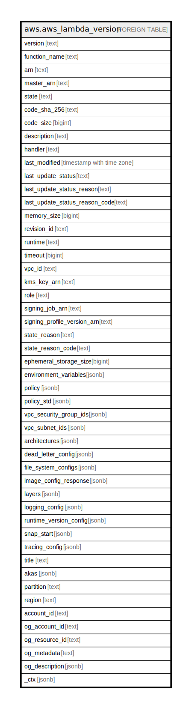

# aws.aws_lambda_version

## Description

AWS Lambda Version

## Columns

| Name | Type | Default | Nullable | Children | Parents | Comment |
| ---- | ---- | ------- | -------- | -------- | ------- | ------- |
| version | text |  | true |  |  | The version of the Lambda function. |
| function_name | text |  | true |  |  | The name of the function. |
| arn | text |  | true |  |  | The function's Amazon Resource Name (ARN). |
| master_arn | text |  | true |  |  | For Lambda@Edge functions, the ARN of the master function. |
| state | text |  | true |  |  | The current state of the function. |
| code_sha_256 | text |  | true |  |  | The SHA256 hash of the function's deployment package. |
| code_size | bigint |  | true |  |  | The size of the function's deployment package, in bytes. |
| description | text |  | true |  |  | The function's description. |
| handler | text |  | true |  |  | The function that Lambda calls to begin executing your function. |
| last_modified | timestamp with time zone |  | true |  |  | The date and time that the function was last updated, in ISO-8601 format. |
| last_update_status | text |  | true |  |  | The status of the last update that was performed on the function. |
| last_update_status_reason | text |  | true |  |  | The reason for the last update that was performed on the function. |
| last_update_status_reason_code | text |  | true |  |  | The reason code for the last update that was performed on the function. |
| memory_size | bigint |  | true |  |  | The memory that's allocated to the function. |
| revision_id | text |  | true |  |  | The latest updated revision of the function or alias. |
| runtime | text |  | true |  |  | The runtime environment for the Lambda function. |
| timeout | bigint |  | true |  |  | The amount of time in seconds that Lambda allows a function to run before stopping it. |
| vpc_id | text |  | true |  |  | The ID of the VPC. |
| kms_key_arn | text |  | true |  |  | The KMS key that's used to encrypt the function's environment variables. |
| role | text |  | true |  |  | The function's execution role. |
| signing_job_arn | text |  | true |  |  | The ARN of the signing job. |
| signing_profile_version_arn | text |  | true |  |  | The ARN of the signing profile version. |
| state_reason | text |  | true |  |  | The reason for the function's current state. |
| state_reason_code | text |  | true |  |  | The reason code for the function's current state. |
| ephemeral_storage_size | bigint |  | true |  |  | The size of the function's /tmp directory in MB. |
| environment_variables | jsonb |  | true |  |  | The environment variables that are accessible from function code during execution. |
| policy | jsonb |  | true |  |  | Contains the resource-based policy. |
| policy_std | jsonb |  | true |  |  | Contains the contents of the resource-based policy in a canonical form for easier searching. |
| vpc_security_group_ids | jsonb |  | true |  |  | A list of VPC security groups IDs attached to Lambda function. |
| vpc_subnet_ids | jsonb |  | true |  |  | A list of VPC subnet IDs attached to Lambda function. |
| architectures | jsonb |  | true |  |  | The instruction set architecture that the function supports. |
| dead_letter_config | jsonb |  | true |  |  | The function's dead letter queue configuration. |
| file_system_configs | jsonb |  | true |  |  | Connection settings for an Amazon EFS file system. |
| image_config_response | jsonb |  | true |  |  | The function's image configuration values. |
| layers | jsonb |  | true |  |  | The function's layers. |
| logging_config | jsonb |  | true |  |  | The function's Amazon CloudWatch Logs configuration settings. |
| runtime_version_config | jsonb |  | true |  |  | The ARN of the runtime and any errors that occurred. |
| snap_start | jsonb |  | true |  |  | Configuration for creating a snapshot of the initialized execution environment. |
| tracing_config | jsonb |  | true |  |  | The function's X-Ray tracing configuration. |
| title | text |  | true |  |  | Title of the resource. |
| akas | jsonb |  | true |  |  | Array of globally unique identifier strings (also known as) for the resource. |
| partition | text |  | true |  |  | The AWS partition in which the resource is located (aws, aws-cn, or aws-us-gov). |
| region | text |  | true |  |  | The AWS Region in which the resource is located. |
| account_id | text |  | true |  |  | The AWS Account ID in which the resource is located. |
| og_account_id | text |  | true |  |  | The Platform Account ID in which the resource is located. |
| og_resource_id | text |  | true |  |  | The unique ID of the resource in opengovernance. |
| og_metadata | text |  | true |  |  | Platform Metadata of the AWS resource. |
| og_description | jsonb |  | true |  |  | The full model description of the resource |
| _ctx | jsonb |  | true |  |  | Steampipe context in JSON form, e.g. connection_name. |

## Relations

---

> Generated by [tbls](https://github.com/k1LoW/tbls)
