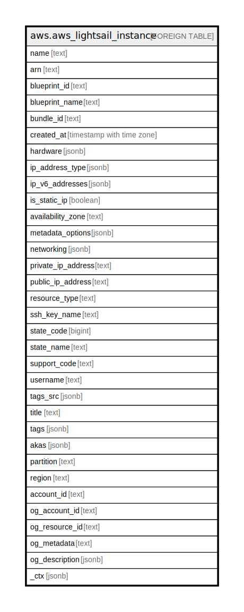

# aws.aws_lightsail_instance

## Description

AWS Lightsail Instance

## Columns

| Name | Type | Default | Nullable | Children | Parents | Comment |
| ---- | ---- | ------- | -------- | -------- | ------- | ------- |
| name | text |  | true |  |  | The name of the instance. |
| arn | text |  | true |  |  | The Amazon Resource Name (ARN) specifying the instance. |
| blueprint_id | text |  | true |  |  | The blueprint ID (e.g., os_amlinux_2016_03). |
| blueprint_name | text |  | true |  |  | The friendly name of the blueprint (e.g., Amazon Linux). |
| bundle_id | text |  | true |  |  | The bundle for the instance (e.g., micro_1_0). |
| created_at | timestamp with time zone |  | true |  |  | The timestamp when the instance was created. |
| hardware | jsonb |  | true |  |  | The size of the vCPU and the amount of RAM for the instance. |
| ip_address_type | jsonb |  | true |  |  | The IP address type of the instance. |
| ip_v6_addresses | jsonb |  | true |  |  | The IPv6 addresses of the instance. |
| is_static_ip | boolean |  | true |  |  | A Boolean value indicating whether this instance has a static IP assigned to it. |
| availability_zone | text |  | true |  |  | The Availability Zone where the instance is located. |
| metadata_options | jsonb |  | true |  |  | The metadata options for the Amazon Lightsail instance. |
| networking | jsonb |  | true |  |  | Information about the public ports and monthly data transfer rates for the instance. |
| private_ip_address | text |  | true |  |  | The private IP address of the instance. |
| public_ip_address | text |  | true |  |  | The public IP address of the instance. |
| resource_type | text |  | true |  |  | The type of resource. |
| ssh_key_name | text |  | true |  |  | The name of the SSH key being used to connect to the instance. |
| state_code | bigint |  | true |  |  | The status code for the instance. |
| state_name | text |  | true |  |  | The status of the instance. |
| support_code | text |  | true |  |  | The support code. |
| username | text |  | true |  |  | The user name for connecting to the instance. |
| tags_src | jsonb |  | true |  |  | A list of tags assigned to the instance. |
| title | text |  | true |  |  | Title of the resource. |
| tags | jsonb |  | true |  |  | A map of tags for the resource. |
| akas | jsonb |  | true |  |  | Array of globally unique identifier strings (also known as) for the resource. |
| partition | text |  | true |  |  | The AWS partition in which the resource is located (aws, aws-cn, or aws-us-gov). |
| region | text |  | true |  |  | The AWS Region in which the resource is located. |
| account_id | text |  | true |  |  | The AWS Account ID in which the resource is located. |
| og_account_id | text |  | true |  |  | The Platform Account ID in which the resource is located. |
| og_resource_id | text |  | true |  |  | The unique ID of the resource in opengovernance. |
| og_metadata | text |  | true |  |  | Platform Metadata of the AWS resource. |
| og_description | jsonb |  | true |  |  | The full model description of the resource |
| _ctx | jsonb |  | true |  |  | Steampipe context in JSON form, e.g. connection_name. |

## Relations

---

> Generated by [tbls](https://github.com/k1LoW/tbls)
