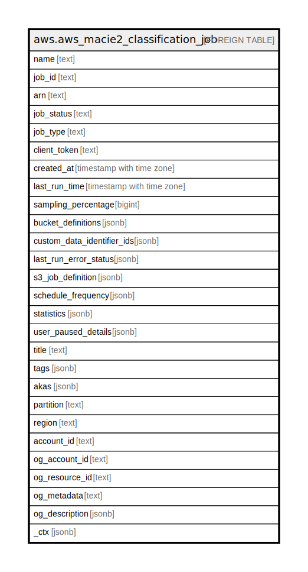

# aws.aws_macie2_classification_job

## Description

AWS Macie2 Classification Job

## Columns

| Name | Type | Default | Nullable | Children | Parents | Comment |
| ---- | ---- | ------- | -------- | -------- | ------- | ------- |
| name | text |  | true |  |  | The custom name of the job. |
| job_id | text |  | true |  |  | The unique identifier for the job. |
| arn | text |  | true |  |  | The Amazon Resource Name (ARN) of the job. |
| job_status | text |  | true |  |  | The status of a classification job. |
| job_type | text |  | true |  |  | The schedule for running a classification job. |
| client_token | text |  | true |  |  | The token that was provided to ensure the idempotency of the request to create the job. |
| created_at | timestamp with time zone |  | true |  |  | The date and time, in UTC and extended ISO 8601 format, when the job was created. |
| last_run_time | timestamp with time zone |  | true |  |  | This value indicates when the most recent run started. |
| sampling_percentage | bigint |  | true |  |  | The sampling depth, as a percentage, that determines the percentage of eligible objects that the job analyzes. |
| bucket_definitions | jsonb |  | true |  |  | The namespace of the AWS service that provides the resource, or a custom-resource. |
| custom_data_identifier_ids | jsonb |  | true |  |  | The custom data identifiers that the job uses to analyze data. |
| last_run_error_status | jsonb |  | true |  |  | Specifies whether any account- or bucket-level access errors occurred when a classification job ran. |
| s3_job_definition | jsonb |  | true |  |  | Specifies which S3 buckets contain the objects that a classification job analyzes, and the scope of that analysis. |
| schedule_frequency | jsonb |  | true |  |  | Specifies the recurrence pattern for running a classification job. |
| statistics | jsonb |  | true |  |  | Provides processing statistics for a classification job. |
| user_paused_details | jsonb |  | true |  |  | Provides information about when a classification job was paused. |
| title | text |  | true |  |  | Title of the resource. |
| tags | jsonb |  | true |  |  | A map of tags for the resource. |
| akas | jsonb |  | true |  |  | Array of globally unique identifier strings (also known as) for the resource. |
| partition | text |  | true |  |  | The AWS partition in which the resource is located (aws, aws-cn, or aws-us-gov). |
| region | text |  | true |  |  | The AWS Region in which the resource is located. |
| account_id | text |  | true |  |  | The AWS Account ID in which the resource is located. |
| og_account_id | text |  | true |  |  | The Platform Account ID in which the resource is located. |
| og_resource_id | text |  | true |  |  | The unique ID of the resource in opengovernance. |
| og_metadata | text |  | true |  |  | Platform Metadata of the AWS resource. |
| og_description | jsonb |  | true |  |  | The full model description of the resource |
| _ctx | jsonb |  | true |  |  | Steampipe context in JSON form, e.g. connection_name. |

## Relations

---

> Generated by [tbls](https://github.com/k1LoW/tbls)
