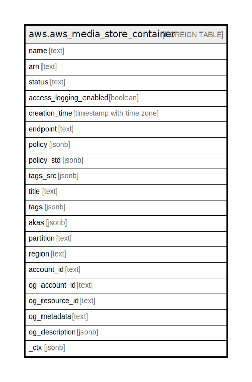

# aws.aws_media_store_container

## Description

AWS Media Store Container

## Columns

| Name | Type | Default | Nullable | Children | Parents | Comment |
| ---- | ---- | ------- | -------- | -------- | ------- | ------- |
| name | text |  | true |  |  | The name of the container. |
| arn | text |  | true |  |  | The Amazon Resource Name (ARN) of the container. |
| status | text |  | true |  |  | The status of container creation or deletion. The status is one of the following: 'CREATING', 'ACTIVE', or 'DELETING'. |
| access_logging_enabled | boolean |  | true |  |  | The state of access logging on the container. This value is false by default, indicating that AWS Elemental MediaStore does not send access logs to Amazon CloudWatch Logs. When you enable access logging on the container, MediaStore changes this value to true, indicating that the service delivers access logs for objects stored in that container to CloudWatch Logs. |
| creation_time | timestamp with time zone |  | true |  |  | The Unix timestamp that the container was created. |
| endpoint | text |  | true |  |  | The DNS endpoint of the container. |
| policy | jsonb |  | true |  |  | The contents of the access policy. |
| policy_std | jsonb |  | true |  |  | Contains the contents of the access policy in a canonical form for easier searching. |
| tags_src | jsonb |  | true |  |  | A list of tags associated with the container |
| title | text |  | true |  |  | Title of the resource. |
| tags | jsonb |  | true |  |  | A map of tags for the resource. |
| akas | jsonb |  | true |  |  | Array of globally unique identifier strings (also known as) for the resource. |
| partition | text |  | true |  |  | The AWS partition in which the resource is located (aws, aws-cn, or aws-us-gov). |
| region | text |  | true |  |  | The AWS Region in which the resource is located. |
| account_id | text |  | true |  |  | The AWS Account ID in which the resource is located. |
| og_account_id | text |  | true |  |  | The Platform Account ID in which the resource is located. |
| og_resource_id | text |  | true |  |  | The unique ID of the resource in opengovernance. |
| og_metadata | text |  | true |  |  | Platform Metadata of the AWS resource. |
| og_description | jsonb |  | true |  |  | The full model description of the resource |
| _ctx | jsonb |  | true |  |  | Steampipe context in JSON form, e.g. connection_name. |

## Relations

---

> Generated by [tbls](https://github.com/k1LoW/tbls)
