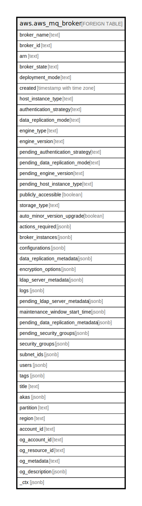

# aws.aws_mq_broker

## Description

AWS MQ Broker

## Columns

| Name | Type | Default | Nullable | Children | Parents | Comment |
| ---- | ---- | ------- | -------- | -------- | ------- | ------- |
| broker_name | text |  | true |  |  | The broker's name. |
| broker_id | text |  | true |  |  | The unique ID that Amazon MQ generates for the broker. |
| arn | text |  | true |  |  | The Amazon Resource Name (ARN) of the broker. |
| broker_state | text |  | true |  |  | The broker's status. |
| deployment_mode | text |  | true |  |  | The broker's deployment mode. |
| created | timestamp with time zone |  | true |  |  | The time when the broker was created. |
| host_instance_type | text |  | true |  |  | The broker's instance type. |
| authentication_strategy | text |  | true |  |  | The authentication strategy used to secure the broker. The default is SIMPLE. |
| data_replication_mode | text |  | true |  |  | Describes whether this broker is a part of a data replication pair. |
| engine_type | text |  | true |  |  | The type of broker engine. Currently, Amazon MQ supports ACTIVEMQ and RABBITMQ. |
| engine_version | text |  | true |  |  | The broker engine's version. |
| pending_authentication_strategy | text |  | true |  |  | The authentication strategy that will be applied when the broker is rebooted. The default is SIMPLE. |
| pending_data_replication_mode | text |  | true |  |  | Describes whether this broker will be a part of a data replication pair after reboot. |
| pending_engine_version | text |  | true |  |  | The broker engine version to upgrade to. |
| pending_host_instance_type | text |  | true |  |  | The broker's host instance type to upgrade to. |
| publicly_accessible | boolean |  | true |  |  | Enables connections from applications outside of the VPC that hosts the broker's subnets. |
| storage_type | text |  | true |  |  | The broker's storage type. |
| auto_minor_version_upgrade | boolean |  | true |  |  | Enables automatic upgrades to new minor versions for brokers, as new versions are released and supported by Amazon MQ. |
| actions_required | jsonb |  | true |  |  | Actions required for a broker. |
| broker_instances | jsonb |  | true |  |  | A list of information about allocated brokers. |
| configurations | jsonb |  | true |  |  | The list of all revisions for the specified configuration. |
| data_replication_metadata | jsonb |  | true |  |  | The replication details of the data replication-enabled broker. Only returned if dataReplicationMode is set to CRDR. |
| encryption_options | jsonb |  | true |  |  | Encryption options for the broker. |
| ldap_server_metadata | jsonb |  | true |  |  | The metadata of the LDAP server used to authenticate and authorize connections to the broker. |
| logs | jsonb |  | true |  |  | The list of information about logs currently enabled and pending to be deployed for the specified broker. |
| pending_ldap_server_metadata | jsonb |  | true |  |  | The metadata of the LDAP server that will be used to authenticate and authorize connections to the broker after it is rebooted. |
| maintenance_window_start_time | jsonb |  | true |  |  | The parameters that determine the WeeklyStartTime. |
| pending_data_replication_metadata | jsonb |  | true |  |  | The pending replication details of the data replication-enabled broker. Only returned if pendingDataReplicationMode is set to CRDR. |
| pending_security_groups | jsonb |  | true |  |  | The list of pending security groups to authorize connections to brokers. |
| security_groups | jsonb |  | true |  |  | The list of rules (1 minimum, 125 maximum) that authorize connections to brokers. |
| subnet_ids | jsonb |  | true |  |  | The list of groups that define which subnets and IP ranges the broker can use from different Availability Zones. |
| users | jsonb |  | true |  |  | The list of all broker usernames for the specified broker. |
| tags | jsonb |  | true |  |  | A list of tags attached to the broker. |
| title | text |  | true |  |  | Title of the resource. |
| akas | jsonb |  | true |  |  | Array of globally unique identifier strings (also known as) for the resource. |
| partition | text |  | true |  |  | The AWS partition in which the resource is located (aws, aws-cn, or aws-us-gov). |
| region | text |  | true |  |  | The AWS Region in which the resource is located. |
| account_id | text |  | true |  |  | The AWS Account ID in which the resource is located. |
| og_account_id | text |  | true |  |  | The Platform Account ID in which the resource is located. |
| og_resource_id | text |  | true |  |  | The unique ID of the resource in opengovernance. |
| og_metadata | text |  | true |  |  | Platform Metadata of the AWS resource. |
| og_description | jsonb |  | true |  |  | The full model description of the resource |
| _ctx | jsonb |  | true |  |  | Steampipe context in JSON form, e.g. connection_name. |

## Relations

---

> Generated by [tbls](https://github.com/k1LoW/tbls)
