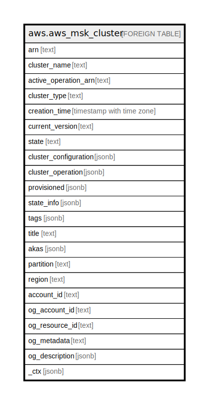

# aws.aws_msk_cluster

## Description

AWS Managed Streaming for Apache Kafka

## Columns

| Name | Type | Default | Nullable | Children | Parents | Comment |
| ---- | ---- | ------- | -------- | -------- | ------- | ------- |
| arn | text |  | true |  |  | The Amazon Resource Name (ARN) that uniquely identifies the Cluster. |
| cluster_name | text |  | true |  |  | The name of the cluster. |
| active_operation_arn | text |  | true |  |  | Arn of active cluster operation. |
| cluster_type | text |  | true |  |  | The type of the cluster. |
| creation_time | timestamp with time zone |  | true |  |  | The time when the cluster was created. |
| current_version | text |  | true |  |  | The current version of the MSK cluster. |
| state | text |  | true |  |  | Settings for open monitoring using Prometheus. |
| cluster_configuration | jsonb |  | true |  |  | Description of this MSK configuration. |
| cluster_operation | jsonb |  | true |  |  | Description of this MSK operation. |
| provisioned | jsonb |  | true |  |  | Information about the provisioned cluster. |
| state_info | jsonb |  | true |  |  | State Info for the Amazon MSK cluster. |
| tags | jsonb |  | true |  |  | A list of tags attached to the Cluster. |
| title | text |  | true |  |  | Title of the resource. |
| akas | jsonb |  | true |  |  | Array of globally unique identifier strings (also known as) for the resource. |
| partition | text |  | true |  |  | The AWS partition in which the resource is located (aws, aws-cn, or aws-us-gov). |
| region | text |  | true |  |  | The AWS Region in which the resource is located. |
| account_id | text |  | true |  |  | The AWS Account ID in which the resource is located. |
| og_account_id | text |  | true |  |  | The Platform Account ID in which the resource is located. |
| og_resource_id | text |  | true |  |  | The unique ID of the resource in opengovernance. |
| og_metadata | text |  | true |  |  | Platform Metadata of the AWS resource. |
| og_description | jsonb |  | true |  |  | The full model description of the resource |
| _ctx | jsonb |  | true |  |  | Steampipe context in JSON form, e.g. connection_name. |

## Relations

---

> Generated by [tbls](https://github.com/k1LoW/tbls)
