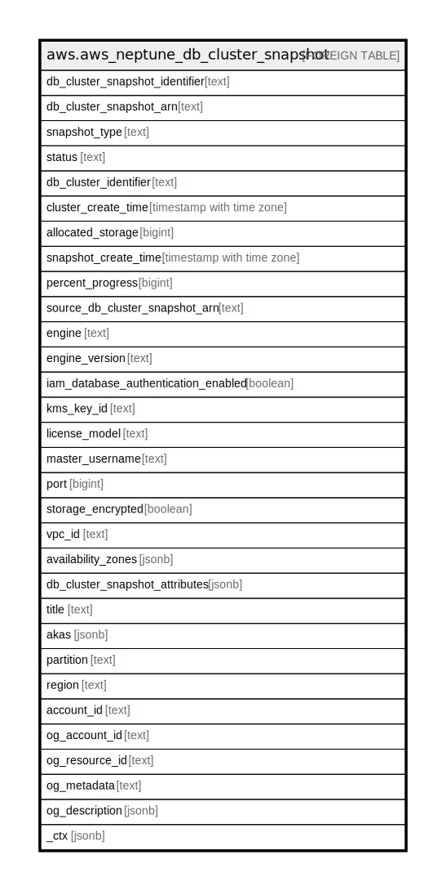

# aws.aws_neptune_db_cluster_snapshot

## Description

AWS Neptune DB Cluster Snapshot

## Columns

| Name | Type | Default | Nullable | Children | Parents | Comment |
| ---- | ---- | ------- | -------- | -------- | ------- | ------- |
| db_cluster_snapshot_identifier | text |  | true |  |  | Specifies the identifier for a DB cluster snapshot. Must match the identifier of an existing snapshot. |
| db_cluster_snapshot_arn | text |  | true |  |  | The Amazon Resource Name (ARN) for the DB cluster snapshot. |
| snapshot_type | text |  | true |  |  | Provides the type of the DB cluster snapshot. |
| status | text |  | true |  |  | Specifies the status of this DB cluster snapshot. |
| db_cluster_identifier | text |  | true |  |  | Specifies the DB cluster identifier of the DB cluster that this DB cluster snapshot was created from. |
| cluster_create_time | timestamp with time zone |  | true |  |  | Specifies the time when the DB cluster was created, in Universal Coordinated Time (UTC). |
| allocated_storage | bigint |  | true |  |  | Specifies the allocated storage size in gibibytes (GiB). |
| snapshot_create_time | timestamp with time zone |  | true |  |  | Provides the time when the snapshot was taken, in Universal Coordinated Time (UTC). |
| percent_progress | bigint |  | true |  |  | Specifies the percentage of the estimated data that has been transferred. |
| source_db_cluster_snapshot_arn | text |  | true |  |  | If the DB cluster snapshot was copied from a source DB cluster snapshot, the Amazon Resource Name (ARN) for the source DB cluster snapshot, otherwise, a null value. |
| engine | text |  | true |  |  | Specifies the name of the database engine. |
| engine_version | text |  | true |  |  | Provides the version of the database engine for this DB cluster snapshot. |
| iam_database_authentication_enabled | boolean |  | true |  |  | True if mapping of Amazon Identity and Access Management (IAM) accounts to database accounts is enabled, and otherwise false. |
| kms_key_id | text |  | true |  |  | If StorageEncrypted is true, the Amazon KMS key identifier for the encrypted DB cluster snapshot. |
| license_model | text |  | true |  |  | Provides the license model information for this DB cluster snapshot. |
| master_username | text |  | true |  |  | Not supported by Neptune. |
| port | bigint |  | true |  |  | Specifies the port that the DB cluster was listening on at the time of the snapshot. |
| storage_encrypted | boolean |  | true |  |  | Specifies whether the DB cluster snapshot is encrypted. |
| vpc_id | text |  | true |  |  | Provides the VPC ID associated with the DB cluster snapshot. |
| availability_zones | jsonb |  | true |  |  | Provides the list of EC2 Availability Zones that instances in the DB cluster snapshot can be restored in. |
| db_cluster_snapshot_attributes | jsonb |  | true |  |  | A list of DB cluster snapshot attribute names and values for a manual DB cluster snapshot. |
| title | text |  | true |  |  | Title of the resource. |
| akas | jsonb |  | true |  |  | Array of globally unique identifier strings (also known as) for the resource. |
| partition | text |  | true |  |  | The AWS partition in which the resource is located (aws, aws-cn, or aws-us-gov). |
| region | text |  | true |  |  | The AWS Region in which the resource is located. |
| account_id | text |  | true |  |  | The AWS Account ID in which the resource is located. |
| og_account_id | text |  | true |  |  | The Platform Account ID in which the resource is located. |
| og_resource_id | text |  | true |  |  | The unique ID of the resource in opengovernance. |
| og_metadata | text |  | true |  |  | Platform Metadata of the AWS resource. |
| og_description | jsonb |  | true |  |  | The full model description of the resource |
| _ctx | jsonb |  | true |  |  | Steampipe context in JSON form, e.g. connection_name. |

## Relations

---

> Generated by [tbls](https://github.com/k1LoW/tbls)
