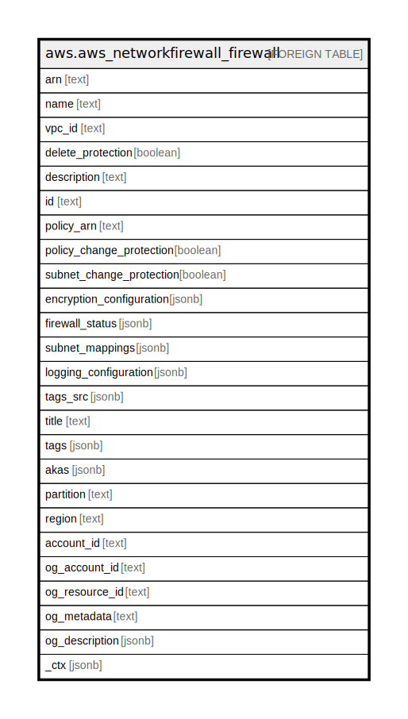

# aws.aws_networkfirewall_firewall

## Description

AWS Network Firewall Firewall

## Columns

| Name | Type | Default | Nullable | Children | Parents | Comment |
| ---- | ---- | ------- | -------- | -------- | ------- | ------- |
| arn | text |  | true |  |  | The Amazon Resource Name (ARN) of the firewall |
| name | text |  | true |  |  | The descriptive name of the firewall. |
| vpc_id | text |  | true |  |  | The unique identifier of the VPC where the firewall is in use. |
| delete_protection | boolean |  | true |  |  | A flag indicating whether it is possible to delete the firewall. |
| description | text |  | true |  |  | A description of the firewall. |
| id | text |  | true |  |  | The id of the firewall. |
| policy_arn | text |  | true |  |  | The Amazon Resource Name (ARN) of the firewall policy. |
| policy_change_protection | boolean |  | true |  |  | A setting indicating whether the firewall is protected against a change to the firewall policy association. |
| subnet_change_protection | boolean |  | true |  |  | A setting indicating whether the firewall is protected against changes to the subnet associations. |
| encryption_configuration | jsonb |  | true |  |  | A complex type that contains the Amazon Web Services KMS encryption configuration settings for the firewall. |
| firewall_status | jsonb |  | true |  |  | Detailed information about the current status of a Firewall. |
| subnet_mappings | jsonb |  | true |  |  | The public subnets that Network Firewall is using for the firewall. |
| logging_configuration | jsonb |  | true |  |  | Defines how Network Firewall performs logging for a Firewall. |
| tags_src | jsonb |  | true |  |  | A list of tags associated with the firewall |
| title | text |  | true |  |  | Title of the resource. |
| tags | jsonb |  | true |  |  | A map of tags for the resource. |
| akas | jsonb |  | true |  |  | Array of globally unique identifier strings (also known as) for the resource. |
| partition | text |  | true |  |  | The AWS partition in which the resource is located (aws, aws-cn, or aws-us-gov). |
| region | text |  | true |  |  | The AWS Region in which the resource is located. |
| account_id | text |  | true |  |  | The AWS Account ID in which the resource is located. |
| og_account_id | text |  | true |  |  | The Platform Account ID in which the resource is located. |
| og_resource_id | text |  | true |  |  | The unique ID of the resource in opengovernance. |
| og_metadata | text |  | true |  |  | Platform Metadata of the AWS resource. |
| og_description | jsonb |  | true |  |  | The full model description of the resource |
| _ctx | jsonb |  | true |  |  | Steampipe context in JSON form, e.g. connection_name. |

## Relations

---

> Generated by [tbls](https://github.com/k1LoW/tbls)
