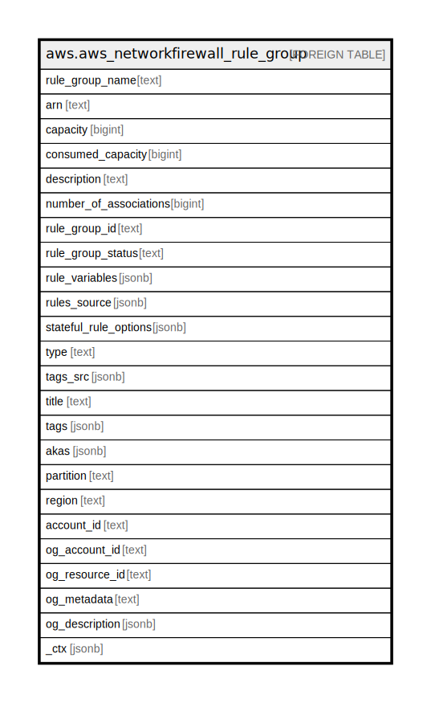

# aws.aws_networkfirewall_rule_group

## Description

AWS Network Firewall Rule Group

## Columns

| Name | Type | Default | Nullable | Children | Parents | Comment |
| ---- | ---- | ------- | -------- | -------- | ------- | ------- |
| rule_group_name | text |  | true |  |  | The descriptive name of the rule group. |
| arn | text |  | true |  |  | The Amazon Resource Name (ARN) of the rule group. |
| capacity | bigint |  | true |  |  | The maximum operating resources that this rule group can use. Rule group capacity is fixed at creation. When you update a rule group, you are limited to this capacity. When you reference a rule group from a firewall policy, Network Firewall reserves this capacity for the rule group. |
| consumed_capacity | bigint |  | true |  |  | The number of capacity units currently consumed by the rule group rules. |
| description | text |  | true |  |  | A description of the rule group. |
| number_of_associations | bigint |  | true |  |  | The number of firewall policies that use this rule group. |
| rule_group_id | text |  | true |  |  | The unique identifier for the rule group. |
| rule_group_status | text |  | true |  |  | Detailed information about the current status of a rule group. |
| rule_variables | jsonb |  | true |  |  | Settings that are available for use in the rules in the rule group. You can only use these for stateful rule groups. |
| rules_source | jsonb |  | true |  |  | The stateful rules or stateless rules for the rule group. |
| stateful_rule_options | jsonb |  | true |  |  | Additional options governing how Network Firewall handles the rule group. You can only use these for stateful rule groups. |
| type | text |  | true |  |  | Indicates whether the rule group is stateless or stateful. If the rule group is stateless, it contains stateless rules. If it is stateful, it contains stateful rules. |
| tags_src | jsonb |  | true |  |  | A list of tags assigned to the resource. |
| title | text |  | true |  |  | Title of the resource. |
| tags | jsonb |  | true |  |  | A map of tags for the resource. |
| akas | jsonb |  | true |  |  | Array of globally unique identifier strings (also known as) for the resource. |
| partition | text |  | true |  |  | The AWS partition in which the resource is located (aws, aws-cn, or aws-us-gov). |
| region | text |  | true |  |  | The AWS Region in which the resource is located. |
| account_id | text |  | true |  |  | The AWS Account ID in which the resource is located. |
| og_account_id | text |  | true |  |  | The Platform Account ID in which the resource is located. |
| og_resource_id | text |  | true |  |  | The unique ID of the resource in opengovernance. |
| og_metadata | text |  | true |  |  | Platform Metadata of the AWS resource. |
| og_description | jsonb |  | true |  |  | The full model description of the resource |
| _ctx | jsonb |  | true |  |  | Steampipe context in JSON form, e.g. connection_name. |

## Relations

---

> Generated by [tbls](https://github.com/k1LoW/tbls)
