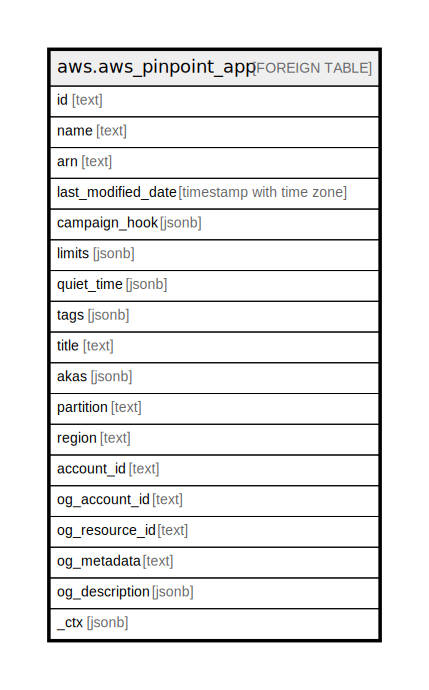

# aws.aws_pinpoint_app

## Description

AWS Pinpoint App

## Columns

| Name | Type | Default | Nullable | Children | Parents | Comment |
| ---- | ---- | ------- | -------- | -------- | ------- | ------- |
| id | text |  | true |  |  | The unique identifier for the application. |
| name | text |  | true |  |  | The display name of the application. |
| arn | text |  | true |  |  | The Amazon Resource Name (ARN) of the application. |
| last_modified_date | timestamp with time zone |  | true |  |  | The date and time, in ISO 8601 format, when the application's settings were last modified. |
| campaign_hook | jsonb |  | true |  |  | The settings for the AWS Lambda function to invoke by default as a code hook for campaigns in the application. |
| limits | jsonb |  | true |  |  | The default sending limits for campaigns in the application. |
| quiet_time | jsonb |  | true |  |  | The default quiet time for campaigns in the application. |
| tags | jsonb |  | true |  |  | A map of tags for the resource. |
| title | text |  | true |  |  | Title of the resource. |
| akas | jsonb |  | true |  |  | Array of globally unique identifier strings (also known as) for the resource. |
| partition | text |  | true |  |  | The AWS partition in which the resource is located (aws, aws-cn, or aws-us-gov). |
| region | text |  | true |  |  | The AWS Region in which the resource is located. |
| account_id | text |  | true |  |  | The AWS Account ID in which the resource is located. |
| og_account_id | text |  | true |  |  | The Platform Account ID in which the resource is located. |
| og_resource_id | text |  | true |  |  | The unique ID of the resource in opengovernance. |
| og_metadata | text |  | true |  |  | Platform Metadata of the AWS resource. |
| og_description | jsonb |  | true |  |  | The full model description of the resource |
| _ctx | jsonb |  | true |  |  | Steampipe context in JSON form, e.g. connection_name. |

## Relations

---

> Generated by [tbls](https://github.com/k1LoW/tbls)
