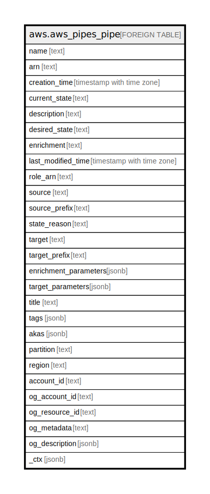

# aws.aws_pipes_pipe

## Description

AWS Pipes Pipe

## Columns

| Name | Type | Default | Nullable | Children | Parents | Comment |
| ---- | ---- | ------- | -------- | -------- | ------- | ------- |
| name | text |  | true |  |  | The name of the pipe. |
| arn | text |  | true |  |  | The Amazon Resource Name (ARN) of the pipe. |
| creation_time | timestamp with time zone |  | true |  |  | The time the pipe was created. |
| current_state | text |  | true |  |  | The state the pipe is in. |
| description | text |  | true |  |  | A description of the pipe. |
| desired_state | text |  | true |  |  | The state the pipe should be in. |
| enrichment | text |  | true |  |  | The ARN of the enrichment resource. |
| last_modified_time | timestamp with time zone |  | true |  |  | When the pipe was last updated. |
| role_arn | text |  | true |  |  | The ARN of the role that allows the pipe to send data to the target. |
| source | text |  | true |  |  | The ARN of the source resource. |
| source_prefix | text |  | true |  |  | The prefix matching the pipe source. |
| state_reason | text |  | true |  |  | The reason the pipe is in its current state. |
| target | text |  | true |  |  | The ARN of the target resource. |
| target_prefix | text |  | true |  |  | The prefix matching the pipe target. |
| enrichment_parameters | jsonb |  | true |  |  | The parameters required to set up enrichment on your pipe. |
| target_parameters | jsonb |  | true |  |  | The parameters required to set up a target for your pipe. |
| title | text |  | true |  |  | Title of the resource. |
| tags | jsonb |  | true |  |  | A map of tags for the resource. |
| akas | jsonb |  | true |  |  | Array of globally unique identifier strings (also known as) for the resource. |
| partition | text |  | true |  |  | The AWS partition in which the resource is located (aws, aws-cn, or aws-us-gov). |
| region | text |  | true |  |  | The AWS Region in which the resource is located. |
| account_id | text |  | true |  |  | The AWS Account ID in which the resource is located. |
| og_account_id | text |  | true |  |  | The Platform Account ID in which the resource is located. |
| og_resource_id | text |  | true |  |  | The unique ID of the resource in opengovernance. |
| og_metadata | text |  | true |  |  | Platform Metadata of the AWS resource. |
| og_description | jsonb |  | true |  |  | The full model description of the resource |
| _ctx | jsonb |  | true |  |  | Steampipe context in JSON form, e.g. connection_name. |

## Relations

---

> Generated by [tbls](https://github.com/k1LoW/tbls)
