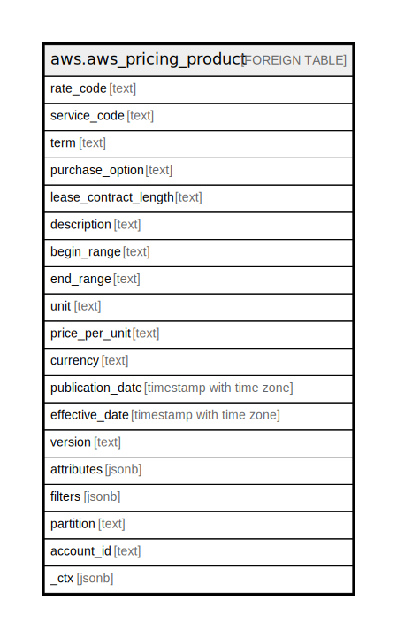

# aws.aws_pricing_product

## Description

AWS Pricing Product

## Columns

| Name | Type | Default | Nullable | Children | Parents | Comment |
| ---- | ---- | ------- | -------- | -------- | ------- | ------- |
| rate_code | text |  | true |  |  | A unique code for a product/ offer/ pricing-tier combination. |
| service_code | text |  | true |  |  | This identifies the specific AWS service to the customer as a unique short abbreviation. |
| term | text |  | true |  |  | Whether your AWS usage is Reserved or On-Demand. |
| purchase_option | text |  | true |  |  | How you chose to pay for this line item (All Upfront, Partial Upfront, No Upfront). |
| lease_contract_length | text |  | true |  |  | The length of time that your RI is reserved for. |
| description | text |  | true |  |  | Description for a product / offer / pricing-tier combination. |
| begin_range | text |  | true |  |  | Start of billing range, by unit |
| end_range | text |  | true |  |  | Enf of billing range, by unit |
| unit | text |  | true |  |  | The pricing unit that AWS used for calculating your usage cost (ex: hours) |
| price_per_unit | text |  | true |  |  | Price by unit |
| currency | text |  | true |  |  | Currency used for the price |
| publication_date | timestamp with time zone |  | true |  |  | The publication date of the offer. |
| effective_date | timestamp with time zone |  | true |  |  | The effective date of the pricing details. |
| version | text |  | true |  |  | The publication version of the offer. |
| attributes | jsonb |  | true |  |  | Product attributes. |
| filters | jsonb |  | true |  |  | Product filtering by attribute. |
| partition | text |  | true |  |  | The AWS partition in which the resource is located (aws, aws-cn, or aws-us-gov). |
| account_id | text |  | true |  |  | The AWS Account ID in which the resource is located. |
| _ctx | jsonb |  | true |  |  | Steampipe context in JSON form, e.g. connection_name. |

## Relations

---

> Generated by [tbls](https://github.com/k1LoW/tbls)
