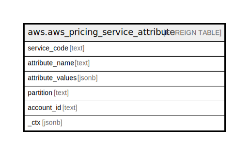

# aws.aws_pricing_service_attribute

## Description

AWS Pricing Service Attribute

## Columns

| Name | Type | Default | Nullable | Children | Parents | Comment |
| ---- | ---- | ------- | -------- | -------- | ------- | ------- |
| service_code | text |  | true |  |  | The service code of the AWS service. |
| attribute_name | text |  | true |  |  | The supported attribute names for the service. |
| attribute_values | jsonb |  | true |  |  | The supported attribute values for the service and attribute name. |
| partition | text |  | true |  |  | The AWS partition in which the resource is located (aws, aws-cn, or aws-us-gov). |
| account_id | text |  | true |  |  | The AWS Account ID in which the resource is located. |
| _ctx | jsonb |  | true |  |  | Steampipe context in JSON form, e.g. connection_name. |

## Relations

---

> Generated by [tbls](https://github.com/k1LoW/tbls)
