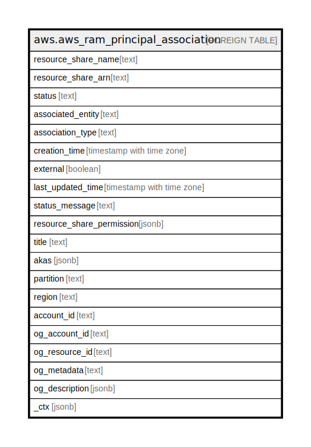

# aws.aws_ram_principal_association

## Description

AWS RAM Principal Association

## Columns

| Name | Type | Default | Nullable | Children | Parents | Comment |
| ---- | ---- | ------- | -------- | -------- | ------- | ------- |
| resource_share_name | text |  | true |  |  | The name of the resource share. |
| resource_share_arn | text |  | true |  |  | The Amazon Resoure Name (ARN) of the resource share. |
| status | text |  | true |  |  | The current status of the association. |
| associated_entity | text |  | true |  |  | The ID of an Amazon Web Services account/The Amazon Resoure Name (ARN) of an organization in Organizations/The ARN of an organizational unit (OU) in Organizations/The ARN of an IAM role The ARN of an IAM user. |
| association_type | text |  | true |  |  | The type of entity included in this association. |
| creation_time | timestamp with time zone |  | true |  |  | The date and time when the association was created. |
| external | boolean |  | true |  |  | Indicates whether the principal belongs to the same organization in Organizations as the Amazon Web Services account that owns the resource share. |
| last_updated_time | timestamp with time zone |  | true |  |  | The date and time when the association was last updated.. |
| status_message | text |  | true |  |  | A message about the status of the association. |
| resource_share_permission | jsonb |  | true |  |  | Information about an RAM permission that is associated with a resource share and any of its resources of a specified type. |
| title | text |  | true |  |  | Title of the resource. |
| akas | jsonb |  | true |  |  | Array of globally unique identifier strings (also known as) for the resource. |
| partition | text |  | true |  |  | The AWS partition in which the resource is located (aws, aws-cn, or aws-us-gov). |
| region | text |  | true |  |  | The AWS Region in which the resource is located. |
| account_id | text |  | true |  |  | The AWS Account ID in which the resource is located. |
| og_account_id | text |  | true |  |  | The Platform Account ID in which the resource is located. |
| og_resource_id | text |  | true |  |  | The unique ID of the resource in opengovernance. |
| og_metadata | text |  | true |  |  | Platform Metadata of the AWS resource. |
| og_description | jsonb |  | true |  |  | The full model description of the resource |
| _ctx | jsonb |  | true |  |  | Steampipe context in JSON form, e.g. connection_name. |

## Relations

---

> Generated by [tbls](https://github.com/k1LoW/tbls)
