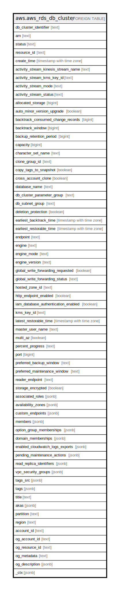

# aws.aws_rds_db_cluster

## Description

AWS RDS DB Cluster

## Columns

| Name | Type | Default | Nullable | Children | Parents | Comment |
| ---- | ---- | ------- | -------- | -------- | ------- | ------- |
| db_cluster_identifier | text |  | true |  |  | The friendly name to identify the DB Cluster. |
| arn | text |  | true |  |  | The Amazon Resource Name (ARN) for the DB Cluster. |
| status | text |  | true |  |  | Specifies the status of this DB Cluster. |
| resource_id | text |  | true |  |  | The AWS Region-unique, immutable identifier for the DB cluster. |
| create_time | timestamp with time zone |  | true |  |  | Specifies the time when the DB cluster was created. |
| activity_stream_kinesis_stream_name | text |  | true |  |  | The name of the Amazon Kinesis data stream used for the database activity stream. |
| activity_stream_kms_key_id | text |  | true |  |  | The AWS KMS key identifier used for encrypting messages in the database activity stream. |
| activity_stream_mode | text |  | true |  |  | The mode of the database activity stream. |
| activity_stream_status | text |  | true |  |  | The status of the database activity stream. |
| allocated_storage | bigint |  | true |  |  | Specifies the allocated storage size in gibibytes (GiB). |
| auto_minor_version_upgrade | boolean |  | true |  |  | A value that indicates that minor version patches are applied automatically. This setting is only for non-Aurora Multi-AZ DB clusters. |
| backtrack_consumed_change_records | bigint |  | true |  |  | The number of change records stored for Backtrack. |
| backtrack_window | bigint |  | true |  |  | The target backtrack window, in seconds. |
| backup_retention_period | bigint |  | true |  |  | Specifies the number of days for which automatic DB snapshots are retained. |
| capacity | bigint |  | true |  |  | The current capacity of an Aurora Serverless DB cluster. |
| character_set_name | text |  | true |  |  | Specifies the name of the character set that this cluster is associated with. |
| clone_group_id | text |  | true |  |  | Identifies the clone group to which the DB cluster is associated. |
| copy_tags_to_snapshot | boolean |  | true |  |  | Specifies whether tags are copied from the DB cluster to snapshots of the DB cluster, or not. |
| cross_account_clone | boolean |  | true |  |  | Specifies whether the DB cluster is a clone of a DB cluster owned by a different AWS account, or not. |
| database_name | text |  | true |  |  | Contains the name of the initial database of this DB cluster that was provided at create time. |
| db_cluster_parameter_group | text |  | true |  |  | Specifies the name of the DB cluster parameter group for the DB cluster. |
| db_subnet_group | text |  | true |  |  | Specifies information on the subnet group associated with the DB cluster. |
| deletion_protection | boolean |  | true |  |  | Specifies whether the DB cluster has deletion protection enabled, or not. |
| earliest_backtrack_time | timestamp with time zone |  | true |  |  | The earliest time to which a DB cluster can be backtracked. |
| earliest_restorable_time | timestamp with time zone |  | true |  |  | The earliest time to which a database can be restored with point-in-time restore. |
| endpoint | text |  | true |  |  | Specifies the connection endpoint for the primary instance of the DB cluster. |
| engine | text |  | true |  |  | The name of the database engine to be used for this DB cluster. |
| engine_mode | text |  | true |  |  | The DB engine mode of the DB cluster. |
| engine_version | text |  | true |  |  | Indicates the database engine version. |
| global_write_forwarding_requested | boolean |  | true |  |  | Specifies whether you have requested to enable write forwarding for a secondary cluster in an Aurora global database, or not. |
| global_write_forwarding_status | text |  | true |  |  | Specifies whether a secondary cluster in an Aurora global database has write forwarding enabled, or not. |
| hosted_zone_id | text |  | true |  |  | Specifies the ID that Amazon Route 53 assigns when you create a hosted zone. |
| http_endpoint_enabled | boolean |  | true |  |  | Specifies whether the HTTP endpoint for an Aurora Serverless DB cluster is enabled, or not. |
| iam_database_authentication_enabled | boolean |  | true |  |  | Specifies whether the the mapping of AWS IAM accounts to database accounts is enabled, or not. |
| kms_key_id | text |  | true |  |  | The AWS KMS key identifier for the encrypted DB cluster. |
| latest_restorable_time | timestamp with time zone |  | true |  |  | Specifies the latest time to which a database can be restored with point-in-time restore. |
| master_user_name | text |  | true |  |  | Contains the master username for the DB cluster. |
| multi_az | boolean |  | true |  |  | Specifies whether the DB cluster has instances in multiple Availability Zones, or not. |
| percent_progress | text |  | true |  |  | Specifies the progress of the operation as a percentage. |
| port | bigint |  | true |  |  | Specifies the port that the database engine is listening on. |
| preferred_backup_window | text |  | true |  |  | Specifies the daily time range during which automated backups are created. |
| preferred_maintenance_window | text |  | true |  |  | Specifies the weekly time range during which system maintenance can occur |
| reader_endpoint | text |  | true |  |  | The reader endpoint for the DB cluster. |
| storage_encrypted | boolean |  | true |  |  | Specifies whether the DB cluster is encrypted, or not. |
| associated_roles | jsonb |  | true |  |  | A list of AWS IAM roles that are associated with the DB cluster. |
| availability_zones | jsonb |  | true |  |  | A list of Availability Zones (AZs) where instances in the DB cluster can be created. |
| custom_endpoints | jsonb |  | true |  |  | A list of all custom endpoints associated with the cluster. |
| members | jsonb |  | true |  |  | A list of instances that make up the DB cluster. |
| option_group_memberships | jsonb |  | true |  |  | A list of option group memberships for this DB cluster. |
| domain_memberships | jsonb |  | true |  |  | A list of Active Directory Domain membership records associated with the DB cluster. |
| enabled_cloudwatch_logs_exports | jsonb |  | true |  |  | A list of log types that this DB cluster is configured to export to CloudWatch Logs. |
| pending_maintenance_actions | jsonb |  | true |  |  | A list that provides details about the pending maintenance actions for the resource. |
| read_replica_identifiers | jsonb |  | true |  |  | A list of identifiers of the read replicas associated with this DB cluster. |
| vpc_security_groups | jsonb |  | true |  |  | A list of VPC security groups that the DB cluster belongs to. |
| tags_src | jsonb |  | true |  |  | A list of tags attached to the DB Cluster. |
| tags | jsonb |  | true |  |  | A map of tags for the resource. |
| title | text |  | true |  |  | Title of the resource. |
| akas | jsonb |  | true |  |  | Array of globally unique identifier strings (also known as) for the resource. |
| partition | text |  | true |  |  | The AWS partition in which the resource is located (aws, aws-cn, or aws-us-gov). |
| region | text |  | true |  |  | The AWS Region in which the resource is located. |
| account_id | text |  | true |  |  | The AWS Account ID in which the resource is located. |
| og_account_id | text |  | true |  |  | The Platform Account ID in which the resource is located. |
| og_resource_id | text |  | true |  |  | The unique ID of the resource in opengovernance. |
| og_metadata | text |  | true |  |  | Platform Metadata of the AWS resource. |
| og_description | jsonb |  | true |  |  | The full model description of the resource |
| _ctx | jsonb |  | true |  |  | Steampipe context in JSON form, e.g. connection_name. |

## Relations

---

> Generated by [tbls](https://github.com/k1LoW/tbls)
